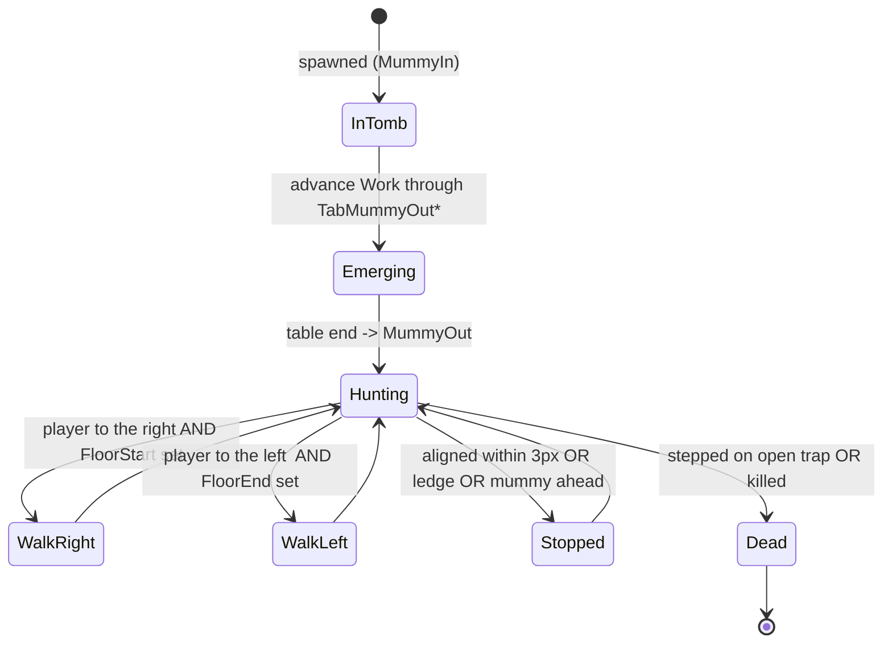
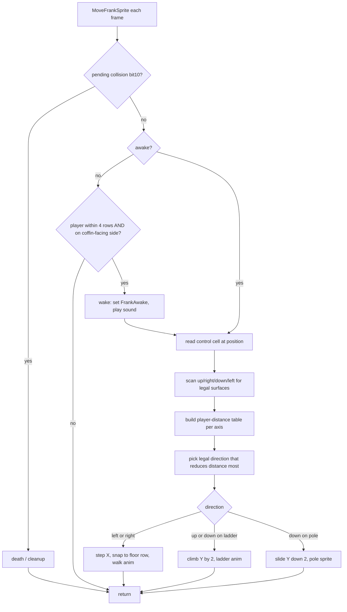

# The Castles of Dr. Creep — Enemy Behaviour & Motion

How every hostile entity moves and decides, reconstructed from the movement routines in
`Creep Sourcecode/asm/object.asm`. Line numbers below are into that file. The engine (`object.prg`)
runs these once per frame from the sprite dispatch inside `events_Execute`.

> The reconstructed source ("Dr Creep 3") and the Ghidra dump `C64_MEMORY_DUMP.BIN` are different
> builds; routine *behaviour* is identical, but absolute RAM addresses differ. This doc cites the
> source (line numbers + labels), which is byte-exact.

---

## 1. The shared model

Everything that moves is a **sprite** of one of six types (`CC_WaS_SpriteType`, +1 of the 32-byte
sprite work area). Each frame the engine indexes the `SpriteMove` dispatch table by type and calls
the matching `Move*Sprite` routine:

| Type | Value | Move routine | Line | Role |
|------|:-----:|--------------|-----:|------|
| Player | `$00` | `MovePlayerSprite` | 5925 | joystick-controlled (not an enemy) |
| Spark  | `$01` | `MoveSparkSprite`  | 6297 | lightning-machine arc |
| Force  | `$02` | `MoveForceSprite`  | 6343 | force field |
| Mummy  | `$03` | `MoveMummySprite`  | 6438 | tomb monster |
| Beam   | `$04` | `MoveBeamSprite`   | 6661 | ray-gun laser |
| Frank  | `$05` | `MoveFrankSprite`  | 6712 | Frankenstein |

Two things drive all enemy motion:

- **The move-control map** at `$c000` — one byte per screen cell describing the *surface* there.
  Bits `$01`=ladder, `$04`=floor-start/ground, `$10`=pole, `$40`=floor-end. Enemies read this cell
  to decide whether a step or a climb is legal, so they follow the room's geometry instead of
  walking through walls or off into space.
- **The sprite flag byte** (`CC_WaS_SpriteFlag`, +0): `$01` inactive, `$02` sprite-sprite
  collision, `$04` sprite-background collision, `$10` pending action, `$20` death, `$40` dead,
  `$80` init. Every `Move*Sprite` first checks bit `$10` (a pending collision/action) and, if set,
  branches to the death/cleanup path. **Touching the player is fatal to the player**; monsters that
  step onto an open trap door die themselves.

Enemies fall into two classes: **pursuers** (Mummy, Frank) that chase the player, and **mechanical
hazards** (Beam, Spark, Force) that follow a fixed pattern and kill only on contact.

---

## 2. Mummy — horizontal floor-walker (`MoveMummySprite`, 6438)

The mummy is a 1-D chaser confined to whatever floor it is standing on.

**Emergence.** Newly-spawned, its `EnemyStatus` is `MummyIn`. Each frame it advances a `Work`
counter through `TabMummyOutSpriteNo` / `TabMummyOutColOff` / `TabMummyOutRowOff`, animating itself
climbing out of the tomb (with a tone that rises as `Work*4`). When the table ends it flips to
`MummyOut` and starts hunting.

**Pursuit (X only).** It selects the first living player, then compares X:

- `|MummyX − PlayerX| < 3` → **stop** and play a stand animation (it is "on the player's column").
- Player to the right → move **right** (`inc PosX`); player to the left → move **left**.

**Gating — it cannot fall or climb.** Before stepping it tests the control cell: `FloorStart`
(`$04`) must be set to move right, `FloorEnd` (`$40`) to move left. At a ledge/gap the bit is clear
and it **stops at the floor end** rather than walk off. It has *no* ladder or pole handling at all —
this is the in-game "mummies are too stiff to use ladders or sliding poles." The `MummyCollLeft` /
`MummyCollRight` flags make it also stop instead of piling into another mummy.

*Beat it by changing floors: go up a ladder or down a pole — it can only pace its own level.*

---

## 3. Frankenstein — 2-D greedy pursuer (`MoveFrankSprite`, 6712)

Frank ("Frank N. Forter") is the dangerous one: he navigates the full floor/ladder/pole graph.

**Waking (6721–6785).** He sleeps in his coffin until a player is **within 4 rows**
(`FrankPosY − PlayerY < 4`) *and* approaches from the side the coffin faces (`FrankCoffinLeft` bit
vs which side the player is on). Only then does he set `FrankAwake` and play the "Frank Out" sound.
(In demo mode he never wakes.)

**Reading his options (6820–6860).** He reads the control cell at his position and scans the four
directions (`up=$00, right=$02, down=$04, left=$06`), counting how many are traversable
(`MovFrankMoveOk`) and remembering which. One legal exit → forced that way (corridor). A ladder/pole
crossing gets special junction handling.

**Choosing a direction (6862–6960).** He builds a 4-slot table `MovFrankP_PosTab` of the nearest
living player's distance along each axis (`up=0, right=1→2, down=2, left=3→6`), then greedily picks
the **legal direction with the smallest remaining distance** — i.e. whichever open move closes the
gap most. If that direction is blocked by geometry, he falls back to the next-best; if none work he
idles this frame.

**Moving (6960–7060).** Once a direction is chosen he moves like the player can:

- **Left/Right** — `dec/inc PosX`, snap to the floor row, cycle the 3-frame walk animation.
- **Up/Down** — snap to the ladder/pole column, then: if on a **ladder** (checking `LadderBot` on
  the current cell and the cell one row below) climb `PosY ± 2` with the ladder animation; if on a
  **pole** slide **down** `PosY + 2` with the pole sprite.

He writes his state back to the room's Frank record so it persists across frames.

*Beat it by keeping distance and using its wake rules — approach from behind the coffin, or lure it
onto an open trap door.*

---

## 4. Ray gun + beam

Two cooperating pieces: the **gun** (a stationary room *object*) aims, the **beam** (a *sprite*)
flies.

**Gun aiming — `AutoRayGunAim` (4566).** Every 4th action tick (`CountActnHdlrCalls & 3`) it targets
the **nearest player by vertical distance**: it walks the player list (player 2 then player 1, so
player 1 wins ties), keeps the smallest `|PlayerY − GunRow|`, and sets its barrel to move **up** if
that player is above it (or below screen row `$c8`) or **down** if below. So the barrel continuously
tracks the closest player's height and fires when lined up.

**Beam flight — `MoveBeamSprite` (6661).** The beam travels in a **straight horizontal line**:
`PosX += Work` (signed step, direction from the gun). When it reaches a wall edge (`≥ $b0` or
`< $08`) it sets the action flag and expires; on contact it marks the gun's data dead.

*Danger is being on the gun's current row when it fires; the beam itself never turns.*

---

## 5. Lightning machine + spark

**Pole/ball — `AutoLightPole` (4295).** When the machine's switch is **on**, it spawns the spark
(`InitSpriteSpark`) and animates the electric arc down the pole(s); when switched **off** it repaints
the pole in its idle green and removes the spark.

**Spark — `MoveSparkSprite` (6297).** The spark has **no locomotion**. Each frame it just picks a
random animation phase and one of the four spark shapes (`Randomizer & $03`), so it **crackles in
place** as a lethal arc between the poles.

*Beat it by timing your pass, or throwing the machine's switch off.*

---

## 6. Force field (`MoveForceSprite`, 6343; `AutoForceClose`, 4463)

Stationary and player-toggled. While **closed** it **pulses between thin (Phase 01) and thick
(Phase 02)** shapes and *sets floor-control bits* (`CC_CtrlForceLeft/Right`) that make its column an
impassable, lethal wall. The player's force-field button opens it: the field clears those bits and
shows the open sprite (Phase 03) — passable — and `AutoForceClose` re-closes it when the timed
countdown (`CC_WaO_TypForceTimer`, init `$08`, re-pinged every `$1e` ticks) elapses.

*Beat it by pressing its button and crossing during the open window.*

---

## 7. At a glance

| Enemy | Locomotion | Decision rule | Ladders/poles | Player counters |
|-------|-----------|---------------|:-------------:|-----------------|
| **Mummy** | walk, X only | head to player's column on its own floor | ❌ | change floor (climb/slide) |
| **Frankenstein** | full 2-D | greedy best-first toward nearest player over the surface graph | ✅ | outrun; exploit wake side/range; traps |
| **Ray beam** | straight line | gun tracks nearest player's *row*, fires horizontally | — | stay off the firing row |
| **Lightning spark** | none (flicker) | random arc while switched on | — | time the pass; switch it off |
| **Force field** | none (pulse) | blocking wall while closed | — | its button opens a timed window |

**Common death rule:** all five kill the player on sprite contact. The two pursuers are themselves
mortal — stepping onto an *open* trap door (a `TrapDoorHandler` check on the control map) kills a
mummy or Frankenstein, which is the main offensive tool the player has against them.
