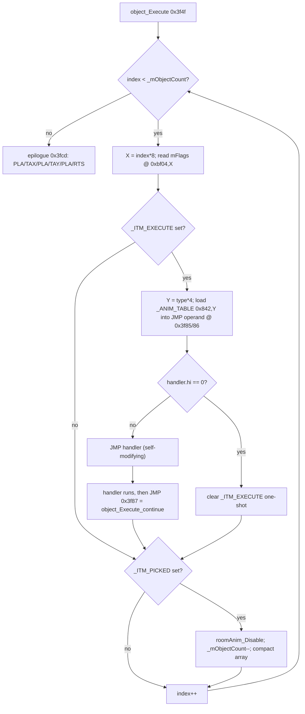
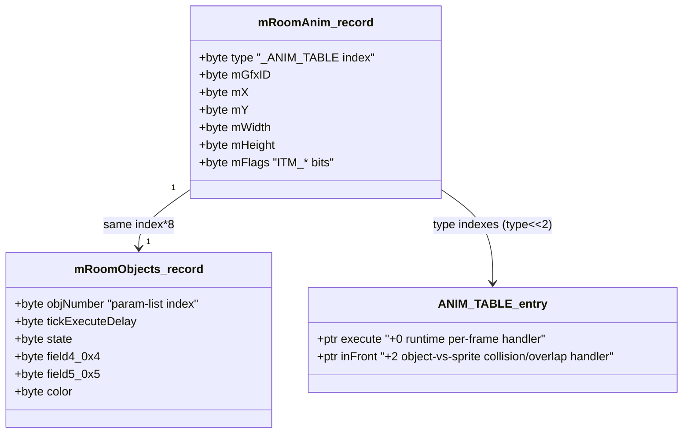
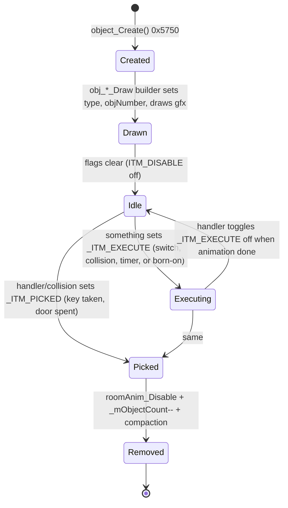

# The Castles of Dr. Creep — Object / Entity Behavior System

This document describes the entity engine of *The Castles of Dr. Creep* (C64), reconstructed
from the annotated 64K RAM dump in Ghidra. It covers the **two parallel per-frame engines**,
their **type → handler dispatch tables**, the **object record layout**, the **object
lifecycle**, and an enumeration of the **per-type handlers** that could be reached through the
call graph.

> **Read-only analysis.** No functions were renamed and no program state was modified. All
> addresses are absolute RAM addresses in hex. Where a fact could not be verified (e.g. the raw
> bytes of a dispatch table), this is called out explicitly in *Open questions / limits*.

---

## 1. Two engines, two worlds

`events_Execute` (`0x2e1c`) is the per-frame heartbeat. Each frame it waits on
`_IRQ_DELAY_COUNTER`, then runs three routines in order:

```
events_Execute (0x2e1c):
    Sprite_Collision_Set()   // 0x2e37  – latch VIC-II collision registers into sprite flags
    Sprite_Execute()         // 0x2e79  – the SPRITE engine (moving creatures)
    object_Execute()         // 0x3f4f  – the OBJECT engine (static room furniture)
    mEngine_Ticks++
```

There are **two distinct entity systems**, each with its own array, its own flags byte, and its
own self-modifying-code dispatch table:

| Engine | Array (base) | Stride | Flags byte | Type field | Dispatch table (base) | Entry stride | Index expr |
|--------|--------------|--------|------------|------------|-----------------------|--------------|------------|
| **Object** (static furniture: doors, traps, keys, …) | `mRoomAnim[]` @ `0xbf00` (+ parallel `mRoomObjects[]` @ `0xbe00`) | 8 | `mFlags` @ +4 (`0xbf04`) | `type` @ +0 (`0xbf00`) | `_ANIM_TABLE` @ `0x0842` | 4 | `type << 2` |
| **Sprite** (player, Frankie, mummy, lightning bolt, laser, force-field, …) | `mRoomSprites[]` @ `0xbd00` | 32 | `state` @ +4 (`0xbd04`) | `spriteType` @ +0 (`0xbd00`) | `mObjectData[]` @ `0x088f` | 8 | `spriteType << 3` |

Both tables hold **two function pointers per entry**:

- Object `_ANIM_TABLE` entry = `{ execute (2 bytes @ +0), inFront (2 bytes @ +2) }`
- Sprite `mObjectData` entry = `{ executePtr (2 bytes @ +0), collisionPtr (2 bytes @ +2), … }` (8-byte stride; remaining 4 bytes not analyzed)

The confusingly-named `obj_*` functions belong to **both** engines: an `obj_X_Execute` /
`obj_X_InFront` that works on `mRoomAnim`/`mObjectPtr` is an **object** handler, whereas an
`obj_X_Execute` / `obj_X_Sprite_Collision` that works on `mRoomSprites` and tail-calls `FUN_2eeb`
is a **sprite** handler. This document focuses on the **object engine / `_ANIM_TABLE`** as
requested, but also documents the sprite dispatch because the prompt's premise conflated the two.

---

## 2. `object_Execute` (`0x3f4f`) — the per-frame object loop

Verified from both the decompiler and the raw disassembly. Annotated disassembly of the core:

```
3f54  LDA #0;  STA 0x3fd4            ; VAR_OBJ_INDEX = 0
3f59  LDA 0x3fd4; CMP 0x083e         ; compare index with _mObjectCount (0x083e)
3f5f  BCC 0x3f64; JMP 0x3fcd         ; if index >= count -> return (epilogue)
3f64  ASL;ASL;ASL; TAX               ; X = index * 8   (8 bytes per object record)
3f68  LDA 0xbf04,X                   ; A = mRoomAnim[i].mFlags
3f6b  BIT 0x0840; BEQ 0x3f96         ; test _ITM_EXECUTE (0x0840); skip if clear
3f70  LDA 0xbf00,X                   ; A = mRoomAnim[i].type
3f73  ASL;ASL; TAY                   ; Y = type * 4    (4 bytes per _ANIM_TABLE entry)
3f76  LDA 0x842,Y; STA 0x3f85        ; copy handler.lo into the operand of the JMP below
3f7c  LDA 0x843,Y; STA 0x3f86        ; copy handler.hi
3f82  BEQ 0x3f8a                     ; if handler.hi == 0 -> no handler, clear EXECUTE flag
3f84  JMP 0x3f85                     ; *** SELF-MODIFYING DISPATCH: JMP <handler> ***
3f87  JMP 0x3f93                     ; handlers RETURN by jumping here (object_Execute_continue)
3f8a  ... EOR 0x0840 ...             ; toggle _ITM_EXECUTE off (one-shot)
3f93  LDA 0xbf04,X                   ; reload flags
3f96  BIT 0x0841; BEQ 0x3fc7         ; test _ITM_PICKED (0x0841)
3f9b  JSR 0x57df                     ; roomAnim_Disable(index)
3f9e  DEC 0x083e                     ; _mObjectCount--
3fa1  ...compact arrays...           ; move last record into the freed slot (see below)
3fc7  INC 0x3fd4; JMP 0x3f59         ; index++, loop
```

### Self-modifying-code dispatch

The 6502 has no indirect `JSR`. The engine instead **writes the handler address into the
operand bytes of a `JMP` instruction in its own code**:

- `0x3f85`/`0x3f86` = operand of the `JMP` at `0x3f84` → patched with `_ANIM_TABLE[type].execute`.
- The handler runs, then jumps to **`0x3f87`** (`JMP 0x3f93`) to rejoin the loop. The shared
  symbol for that re-entry is **`object_Execute_continue` (`0x3f87`)** — every object `*_Execute`
  handler ends with `object_Execute_continue(pObjectNumber)`, which the disassembly confirms is a
  `JMP 0x3f87`.

The object **collision/draw-order** path uses the *second* pointer, `_ANIM_TABLE[type].inFront`,
through an analogous patch site at `0x31da`/`0x31db` inside `Sprite_Object_Collision_Check`
(`0x3140`) / `Sprite_Object_Collision_Check_continue` (`0x31ac`).

The sprite engine uses the same trick: `Sprite_Execute` patches `0x2ee9`/`0x2eea` with
`mObjectData[spriteType].executePtr`; the object-collision side patches `0x31aa`/`0x31ab` with
`mObjectData[spriteType].collisionPtr`.



### Array compaction on pick/disable

When a slot has `_ITM_PICKED` set, the engine deactivates it and **swaps the last live record
into the hole** so the array stays dense (`_mObjectCount` records, no gaps):

```
roomAnim_Disable(index);
_mObjectCount--;
src = _mObjectCount * 8;             // byte offset of the (new) last record
if (index == 0) return;              // edge case
for (8 bytes) {
    mRoomAnim[index]   = mRoomAnim[src];      // 0xbf00,X <- 0xbf00,Y   (type + 7 more bytes)
    mRoomObjects[index]= mRoomObjects[src];   // 0xbe00,X <- 0xbe00,Y   (objNumber + 7 more)
    index++; src++;
}
```

> **Note on `FUN_3fcd`.** The prompt suspected a per-frame post-process. It is **not**: `0x3fcd`
> is simply the register-restore **epilogue** of `object_Execute` (`PLA / TAX / PLA / TAY / PLA /
> RTS`) that Ghidra split into a separate "function". There is no post-pass.

---

## 3. Object record layout

Two parallel arrays are indexed by the same byte offset (`objectIndex * 8`).

### `mRoomAnim[]` @ `0xbf00` (visual / collision box)

| Offset | Field (Ghidra) | Meaning |
|-------:|----------------|---------|
| +0 | `type` | object type → index into `_ANIM_TABLE` |
| +1 | `mGfxID` | graphic/text image ID used when (re)drawing or disabling |
| +2 | `mX` | X position (collision box origin) |
| +3 | `mY` | Y position |
| ? | `mWidth` | collision box width (used in collision tests) |
| ? | `mHeight` | collision box height |
| +4 | `mFlags` | status bits (`_ITM_*`, see below) |

(`mWidth`/`mHeight` live in the same 8-byte record; their exact offsets among +5/+6/+7 were not
individually pinned, but they are read as `(&mRoomAnim[0].mWidth)[idx]` / `.mHeight`.)

### `mRoomObjects[]` @ `0xbe00` (per-object state — the `sCreepObject` record)

| Offset | Field (Ghidra) | Meaning |
|-------:|----------------|---------|
| +0 | `objNumber` | index into the *type-specific* parameter list in castle data (e.g. `VAR_TRAPDOOR_ObjPtrsStart + objNumber`) |
| ? | `tickExecuteDelay` | per-tick countdown / sub-state used by `*_Execute` handlers |
| ? | `state` | animation frame / phase counter (e.g. door open 0x0e→0, trapdoor 0x73↔0x78) |
| +4 | `field4_0x4` | scratch (teleport selector X, …) |
| +5 | `field5_0x5` | scratch (teleport selector Y, …) |
| ? | `color` | object colour (teleport, lightning, door) |

Ghidra reports `sCreepObject` with an *overlapping* `stateVar` field — i.e. the record is a union
/ reuse area whose meaning depends on `type`. Different handlers interpret `state` /
`tickExecuteDelay` / `field4` / `field5` / `color` differently.



### `_ITM_*` flag bits (`mRoomAnim.mFlags` @ `0xbf04`)

| Constant | Address of mask | Role |
|----------|-----------------|------|
| `_ITM_EXECUTE` | `0x0840` | If set, `object_Execute` dispatches the object's `.execute` handler this frame. Handlers commonly `^=` (toggle off) it when their animation finishes — a one-shot. |
| `_ITM_PICKED` | `0x0841` | If set, the object is removed: `roomAnim_Disable`, `_mObjectCount--`, array compaction. Used for keys, opened doors, expired effects. |
| `_ITM_DISABLE` | (mask used in `roomAnim_Disable`) | Object is logically gone / erased from screen; collision and re-erase are skipped. Set by `object_Create` on the fresh slot and by `roomAnim_Disable`. |

(Numeric masks: `_ITM_EXECUTE`=mask@`0x0840`, `_ITM_PICKED`=mask@`0x0841`. The dump stores the
actual bit values in those RAM cells; they are referenced via `BIT`/`EOR`/`ORA`.)

---

## 4. Object lifecycle



### Spawn / registration — `object_Create` (`0x5750`)

```c
bool object_Create(void) {
    if (_mObjectCount == 32) return true;          // hard cap: 32 objects
    base = _mObjectCount * 8;
    _mObjectCount++;
    for (8 bytes) { mRoomAnim[slot].type = OBJECT_TYPE_DOOR; mRoomObjects[slot].objNumber = 0; }
    mRoomAnim[firstByteOfSlot].mFlags = _ITM_DISABLE;   // born disabled
    return false;
}
```

So the maximum is **32 simultaneous objects**, each 8 bytes. `object_Create` allocates the next
slot, defaults `type` to `OBJECT_TYPE_DOOR`, and marks it `_ITM_DISABLE`. The caller (an
`obj_*_Draw` builder) then overwrites `type`, sets `objNumber`, fills position fields and draws
the initial graphic via `Draw_RoomAnimObject` (`0x580d`) / `screenDraw` (`0x5783`).

Each object type is built by a dedicated **room-load "Draw" builder** that walks a type-specific
parameter list from the castle data (terminated by an end-marker byte) and calls `object_Create`
once per instance. Confirmed builders:

| Builder | Address | Creates type(s) |
|---------|---------|-----------------|
| `obj_Key_Draw` | `0x4a00` | `OBJECT_TYPE_KEY` |
| `obj_Mummy_Draw` | `0x4900` | `OBJECT_TYPE_MUMMY` |
| `obj_Lightning_Draw` | `0x4400` | `OBJECT_TYPE_LIGHTNING_MACHINE`, `OBJECT_TYPE_LIGHTNING_CONTROL` |
| `obj_RayGun_Draw` | `0x4d00` | `OBJECT_TYPE_RAYGUN_LASER`, `OBJECT_TYPE_RAYGUN_CONTROL` |
| `obj_Forcefield_Draw` | `0x4700` | `OBJECT_TYPE_FORCEFIELD` (+ `obj_Forcefield_Create` spawns a `SPRITE_TYPE_FORCEFIELD` sprite) |
| `obj_TrapDoor_Draw` | `0x5200` | `OBJECT_TYPE_TRAPDOOR_PANEL`, `OBJECT_TYPE_TRAPDOOR_SWITCH` |
| `obj_Teleport_Draw` | `0x5000` | `OBJECT_TYPE_TELEPORTER` |

The player itself is *not* an `mRoomAnim` object: `_obj_Player_Add` (`0x359e`) allocates a
**sprite** via `_Sprite_CreepGetFree` (`0x3f14`, marks slot `SPRITE_TYPE_PLAYER`) and fills
`mRoomSprites` fields (position, size, `spriteID = IMAGE_PLAYER_RUN_LEFT_1`, etc.). Its per-frame
behavior runs in the sprite engine via `obj_Player_Execute` (`0x3200`).

### Disable — `roomAnim_Disable` (`0x57df`)

```c
void roomAnim_Disable(byte index) {
    if ((mRoomAnim[index].mFlags & _ITM_DISABLE) == 0) {
        pDecodeMode   = DECODE_MODE_TEXT_1;        // "text" decode = XOR/erase the cell
        pTxtCurrentID = mRoomAnim[index].mGfxID;
        mTxtX_0       = mRoomAnim[index].mX;
        mTxtY_0       = mRoomAnim[index].mY;
        screenDraw();                              // erases the object's graphic from screen
        mRoomAnim[index].mFlags |= _ITM_DISABLE;
    }
}
```

It erases the object's pixels (by re-drawing its image in the "text"/clear decode mode) and sets
`_ITM_DISABLE`. It is idempotent (guarded by the flag).

---

## 5. Discovered handlers

### 5a. OBJECT-engine handlers (`_ANIM_TABLE` — `.execute` and `.inFront`)

These operate on `mRoomAnim` / `mRoomObjects` / `mObjectPtr`, and `*_Execute` handlers end with
`object_Execute_continue` (`JMP 0x3f87`). They are dispatched by `type` (the `OBJECT_TYPE_*`
constants below), though the **exact numeric type→slot mapping is the unreadable part** (see
limits). Object types confirmed by name in the code: `OBJECT_TYPE_DOOR`,
`OBJECT_TYPE_TRAPDOOR_PANEL`, `OBJECT_TYPE_TRAPDOOR_SWITCH`, `OBJECT_TYPE_KEY`,
`OBJECT_TYPE_MUMMY`, `OBJECT_TYPE_TELEPORTER`, `OBJECT_TYPE_LIGHTNING_MACHINE`,
`OBJECT_TYPE_LIGHTNING_CONTROL`, `OBJECT_TYPE_FORCEFIELD`, `OBJECT_TYPE_RAYGUN_LASER`,
`OBJECT_TYPE_RAYGUN_CONTROL`.

| Object type | Handler | Address | Role |
|-------------|---------|---------|------|
| DOOR | `obj_Door_Execute` | `0x4000` | Animates a door opening (state `0x0e`→0); marks linked room visible; plays `SOUND_DOOR_OPEN`; toggles `_ITM_EXECUTE` off when fully open. |
| DOOR (`.inFront`) | `obj_Door_InFront` | `0x4100` | Player pressing **UP** at a doorway enters it: sets player colour BLUE, repositions, sets `current_room`/`current_door`, marks destination room visible, sets `room_exit_flag` if it is an exit door. |
| DOOR button (`.inFront`) | `obj_Door_Button_InFront` | `0x4200` | Player at a door **button**: finds the matching `OBJECT_TYPE_DOOR` and sets its `_ITM_EXECUTE` to start the open animation. |
| TRAPDOOR switch | `obj_TrapDoor_Switch_Execute` | `0x5100` | Animates the trapdoor switch lever (state `0x73`↔`0x78`); calls `obj_TrapDoor_PlaySound`; disables/toggles when done. |
| TRAPDOOR switch toggle | `obj_TrapDoor_Switch_Check` | `0x526f` (also `0x5300`) | Toggles `TRAPDOOR_OPEN`; finds the paired `OBJECT_TYPE_TRAPDOOR_PANEL`, sets its `_ITM_EXECUTE`, and pokes the C000 collision map so the floor opens/closes. Called from player/Frankie sprite handlers when they step on a switch. |
| KEY (build) | `obj_Key_Draw` | `0x4a00` | Builds `OBJECT_TYPE_KEY` objects; pickup itself is handled in the sprite-collision path (`SOUND_KEY_PICKUP`), which sets `_ITM_PICKED`. |
| MUMMY (`.inFront`) | `obj_Mummy_Infront` | `0x4800` | Player approaches a sealed mummy tomb: opens it (`state`, `tickExecuteDelay=8`), draws the ankh/tomb, and spawns a mummy sprite via `obj_Mummy_Sprite_Create`. |
| TELEPORTER | `obj_Teleport_Execute` | `0x4e40`/`0x4e80` | Animates the teleporter "destination selector" flashing; cycles colour; `SOUND_TELEPORT`; toggles `_ITM_EXECUTE` off when the colour fade completes. |
| TELEPORTER (`.inFront`) | `obj_Teleport_InFront` | `0x4f00` | Player on the pad: joystick cycles the destination; **button** teleports the player to the selected `(x,y)`; `SOUND_TELEPORT_CHANGE`. |
| TELEPORTER colour helper | `obj_Teleport_SetColour` | `0x505c` | Paints the selector colour bars. |
| LIGHTNING machine/pole | `obj_Lightning_Pole_Execute` | `0x4360` | Animates the electric arc down the pole (3-phase bitmap); creates/destroys the lightning **sprite** (`SPRITE_TYPE_LIGHTNING`); shuts off when `LIGHTNING_IS_ON` clears. |
| LIGHTNING control (`.inFront`) | `obj_Lightning_Switch_InFront` | `0x4500` | Player throws the lightning switch (LEFT/centre): toggles `LIGHTNING_IS_ON` on up to 4 linked machines (sets their `_ITM_EXECUTE`); redraws switch; `SOUND_LIGHTNING_SWITCHED`. |
| FORCEFIELD timer | `obj_Forcefield_Timer_Execute` | `0x4600`/`0x4640` | Counts down a temporarily-opened force field (`state` 8→0, `tickExecuteDelay`=0x1e reload); redraws the field bar; on expiry re-closes it and sets the "closed" flag; `SOUND_FORCEFIELD_TIMER`. |
| FORCEFIELD timer (`.inFront`) | `obj_Forcefield_Timer_InFront` | `0x46a0` | Player presses the force-field button: opens the field for 0x1e ticks (`state=8`, `_ITM_EXECUTE` set), clears the closed flag. |
| RAYGUN control | `obj_RayGun_Execute` | `0x4c00` | Auto-aims the ray-gun barrel toward the nearest live player (or honours player control), moves it up/down, and fires a laser sprite via `obj_RayGun_Laser_Sprite_Create`. |
| RAYGUN gfx helper | `obj_RayGun_Control_Update` | `0x4e00` | Repaints the ray-gun control panel colour. |

### 5b. SPRITE-engine handlers (`mObjectData` — `.executePtr` and `.collisionPtr`)

These operate on `mRoomSprites` (32-byte records) and tail-call `FUN_2eeb` (`0x2eeb`, the sprite
draw/advance routine). Dispatched by `spriteType`. Sprite types confirmed: `SPRITE_TYPE_PLAYER`,
`SPRITE_TYPE_FRANKIE`, `SPRITE_TYPE_MUMMY`, `SPRITE_TYPE_FORCEFIELD`, `SPRITE_TYPE_LIGHTNING`.

| Sprite type | Handler | Address | Role |
|-------------|---------|---------|------|
| PLAYER (execute) | `obj_Player_Execute` | `0x3200` | Reads joystick, walks/climbs, handles room-exit run animation, colour state machine (BLACK alive / BLUE entering / GREEN exiting), trapdoor-switch trigger via `obj_TrapDoor_Switch_Check`. |
| PLAYER (collision) | `obj_Player_Collision` | `0x3500` | Player vs object: stepping on an *open* trapdoor panel → player dies (colour RED); on a trapdoor switch → latch the switch index. |
| PLAYER colour helper | `obj_Player_Color_Set` | (called) | Sets the player sprite colour register. |
| FRANKIE (execute) | `obj_Frankie_Execute` | `~0x3a8d` (body spans `0x3b–0x3d`) | Frankenstein-monster AI: wake check vs players, path/seek toward nearest player on ladders/floors, walk & climb animation; writes state back to its param record. |
| FRANKIE (collision) | `obj_Frankie_Sprite_Collision` | `0x3e00` | Frankie vs sprites/objects: kill on contact rules, push direction on Frankie-vs-Frankie, ladder handling. |
| FRANKIE (spawn) | `obj_Frankie_Sprite_Create` | `0x3ef0` | Creates a Frankie sprite (asleep or awake) from its param record. |
| MUMMY (collision) | `obj_Mummy_Collision` | `0x3900` | Mummy vs trapdoor panel/switch and other sprites: dies in open trapdoors; reads switch. |
| MUMMY (sprite collision) | `obj_Mummy_Sprite_Collision` | `0x3960` | Mummy hit handling: marks itself for re-spawn (`*ptr = 3`) unless it hit a player/Frankie. |
| CONVEYOR (execute) | `obj_Conveyor_Execute` | `0x5400` | Toggles the belt on/off when switched by either player; animates belt cells; `SOUND_CONVEYOR_SWITCH`. |
| CONVEYOR (collision/inFront) | `obj_Conveyor_InFront` | `0x5500` | While running, pushes any standing player/mummy/Frankie left or right at belt speed. |

*(Conveyor uses the object arrays for its switch/belt record but is driven through the
object-collision `inFront` path and an `object_Execute_continue` tail — it is an object-engine
entity; listed here next to its sibling for completeness.)*

### 5c. Shared support routines

| Routine | Address | Role |
|---------|---------|------|
| `events_Execute` | `0x2e1c` | Per-frame driver (collision-set → sprite-execute → object-execute). |
| `Sprite_Collision_Set` | `0x2e37` | Latches VIC-II sprite-sprite / sprite-bg collision registers into each sprite's `state`. |
| `Sprite_Execute` | `0x2e79` | Sprite engine main loop; self-modifying dispatch via `mObjectData.executePtr` (`0x2ee9/0x2eea`). |
| `FUN_2eeb` | `0x2eeb` | Sprite advance/draw + collision-check driver (overlaps `Sprite_Execute`'s tail; shared code). |
| `Sprite_Object_Collision_Check` | `0x3140` | Sprite-vs-object box test; dispatches object `.inFront` (`0x31da/db`) and sprite `.collisionPtr` (`0x31aa/ab`). |
| `Sprite_Object_Collision_Check_continue` | `0x31ac` | Re-entry/continue point for object `.inFront` handlers. |
| `object_Create` | `0x5750` | Allocate next `mRoomAnim`/`mRoomObjects` slot (cap 32). |
| `object_Execute_continue` | `0x3f87` | Re-entry point object `*_Execute` handlers jump back to (`JMP 0x3f93` inside `object_Execute`). |
| `roomAnim_Disable` | `0x57df` | Erase + disable an object slot. |
| `Draw_RoomAnimObject` | `0x580d` | Draw an object's graphic and record its draw box. |
| `screenDraw` | `0x5783` | Low-level image blitter (graphics/text/erase decode modes). |
| `_obj_Player_Add` | `0x359e` | Spawn the player **sprite**. |
| `_Sprite_CreepGetFree` | `0x3f14` | Find/allocate a free 32-byte sprite slot. |
| `sound_PlayEffect` | `0x21c8` | Play a sound effect; its header lists the effect IDs, which corroborate the object set (laser, trapdoor, force-field, door, teleport, lightning, conveyor, mummy, key). |

---

## 6. Open questions / limits

The items originally flagged here have now been **byte-verified against the reconstructed source**
(`Creep Sourcecode/inc/CC_WorkAreas.asm`, `asm/object.asm`). Note the source (a "Dr Creep 3" build)
and the Ghidra dump are **different builds**: identical structure/formats but the work-area RAM
base differs by `$2000` (object common WA: dump `$bf00`, source `$9f00`; sprite WA: dump `$bd00`,
source `$9d00`). Field offsets, flag bits and type numbers are the same in both.

**Object type numbers** (`CC_WaO_ObjectType`, +0 of the common work area — the `_ANIM_TABLE`
index):

| # | Type | # | Type |
|---|------|---|------|
| `$00` | Door | `$08` | RayGun (phaser) |
| `$01` | DoorBell | `$09` | RayGunSwitch |
| `$02` | LightBall (lightning ball) | `$0a` | XmitReceiveOval (teleporter) |
| `$03` | LightSwitch | `$0b` | TrapDoor |
| `$04` | ForceField | `$0c` | TrapSwitch |
| `$05` | Mummy | `$0d` | SideWalk (conveyor) |
| `$06` | Key | `$0e` | SideWalkSwitch |
| `$07` | Lock | `$0f` | Frankenstein |

**Sprite type numbers** (`CC_WaS_SpriteType`, +1 of the sprite work area): `$00` Player, `$01`
Spark, `$02` Force, `$03` Mummy, `$04` Beam, `$05` Frank.

**Dispatch tables** — in the source the object `_ANIM_TABLE` is `ObjectMoveAuto`/`ObjectMoveManu`
(interleaved, 4 bytes/type = `{auto per-frame handler, manual player-action handler}` = the
`.execute`/`.inFront` pair). The sprite `mObjectData` is the `SpriteMove` table, **8 bytes/type**:
`{SpriteMove (move), SpriteSpriteKill (sprite-collision), SpriteObjectKill (object-collision),
SpriteCollisionPrio (byte), SpriteMortality (byte)}` — three pointers, not two.

**Object flag byte** (`CC_WaO_ObjectFlag`, common WA +4; the dump's `_ITM_*` masks): `$20` = Move
(per-frame handler due — the doc's `_ITM_EXECUTE`), `$40` = Ready (action completed), `$80` = Init
(just initialised).

**Object common work-area record** (8 bytes): +0 Type, +1 GridCol, +2 GridRow, +3 ObjectNo,
+4 Flag, +5 Cols (×4), +6 Rows. The parallel **special/type record** (`CC_WaO_Type`, 8 bytes) is a
per-type union — e.g. Door `{+0 DoorNo, +1 shut/open, +2 liftCount, +3 targetRoomColour}`,
ForceField `{+0 No, +1 pingSecs, +2 timer}`, Mummy `{+0 ptrWA, +1 timer, +2 ankhColour}`, etc.

**Master room-load orchestrator**: `PaintRoomItems` (`object.asm:2162`) — it walks the threaded
object list and dispatches each `$08xx` id through `ID_Jump_Table`.

### Still open

- `obj_Frankie_Execute`'s exact entry label wasn't isolated (body confirmed over
  `0x3b00`–`0x3d6b`).

### Handlers explicitly CONFIRMED (decompiled in this analysis)

Object engine: `obj_Door_Execute` (0x4000), `obj_Door_InFront` (0x4100),
`obj_Door_Button_InFront` (0x4200), `obj_TrapDoor_Switch_Execute` (0x5100),
`obj_TrapDoor_Switch_Check` (0x526f), `obj_TrapDoor_Draw` (0x5200), `obj_Key_Draw` (0x4a00),
`obj_Mummy_Draw` (0x4900), `obj_Mummy_Infront` (0x4800), `obj_Teleport_Execute` (0x4e40),
`obj_Teleport_InFront` (0x4f00), `obj_Teleport_Draw` (0x5000), `obj_Teleport_SetColour` (0x505c),
`obj_Lightning_Pole_Execute` (0x4360), `obj_Lightning_Switch_InFront` (0x4500),
`obj_Lightning_Draw` (0x4400), `obj_Forcefield_Timer_Execute` (0x4600/0x4640),
`obj_Forcefield_Timer_InFront` (0x46a0), `obj_Forcefield_Draw` (0x4700),
`obj_Forcefield_Create` (0x3757), `obj_RayGun_Execute` (0x4c00), `obj_RayGun_Draw` (0x4d00),
`obj_RayGun_Control_Update` (0x4e00), `obj_Conveyor_Execute` (0x5400),
`obj_Conveyor_InFront` (0x5500), `object_Create` (0x5750), `roomAnim_Disable` (0x57df).

Sprite engine: `obj_Player_Execute` (0x3200), `obj_Player_Collision` (0x3500),
`obj_Frankie_Execute` (~0x3a8d), `obj_Frankie_Sprite_Collision` (0x3e00),
`obj_Frankie_Sprite_Create` (0x3ef0), `obj_Mummy_Collision` (0x3900),
`obj_Mummy_Sprite_Collision` (0x3960).

Engine core: `object_Execute` (0x3f4f), `events_Execute` (0x2e1c), `Sprite_Collision_Set`
(0x2e37), `Sprite_Execute` (0x2e79), `FUN_2eeb` (0x2eeb), `Sprite_Object_Collision_Check`
(0x3140), `Sprite_Object_Collision_Check_continue` (0x31ac), `_obj_Player_Add` (0x359e),
`_Sprite_CreepGetFree` (0x3f14), `sound_PlayEffect` (0x21c8).
