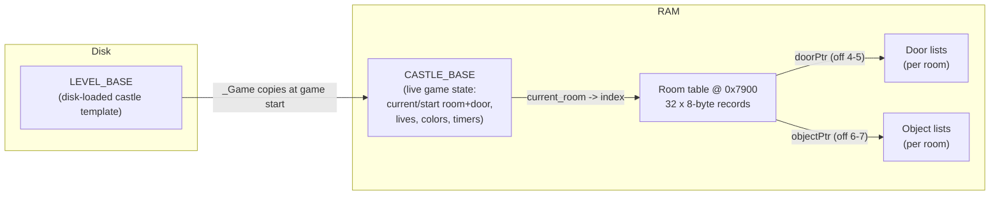
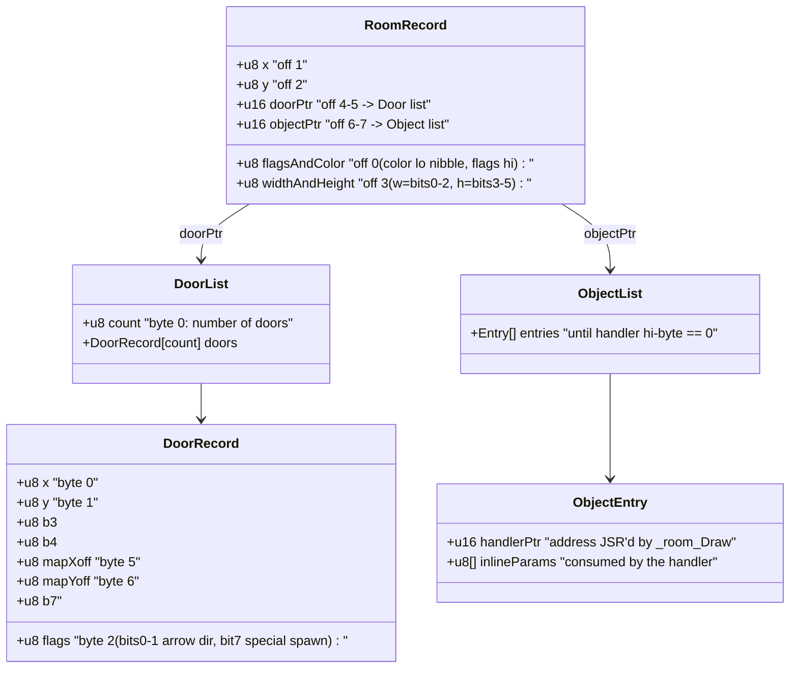
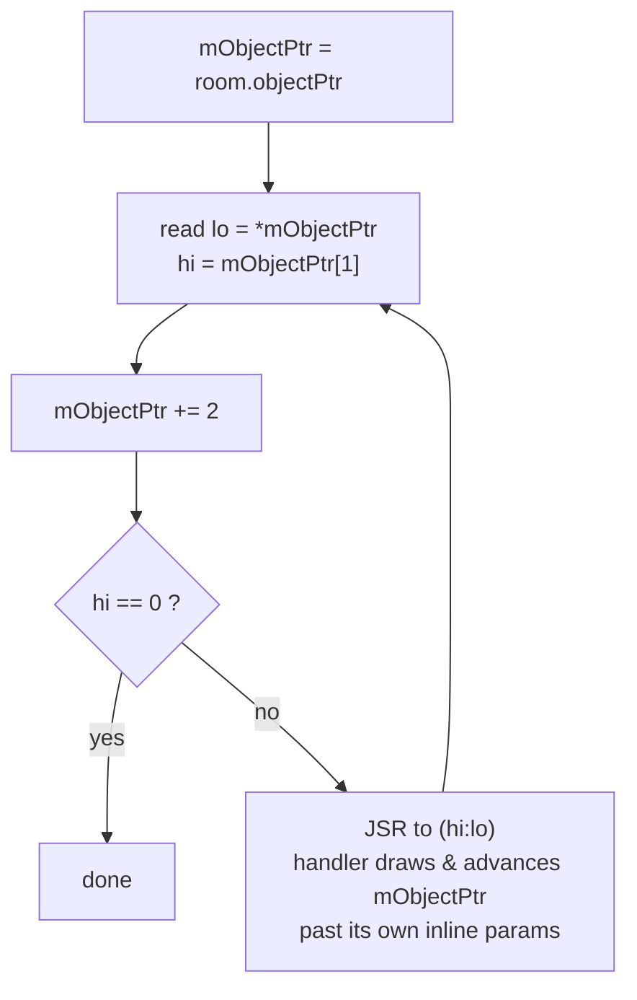
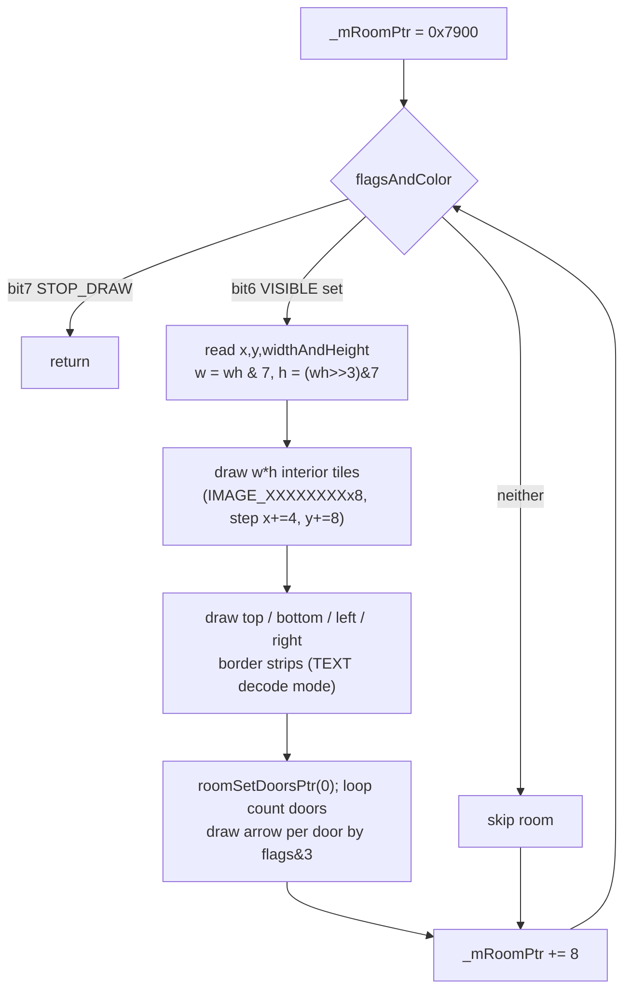
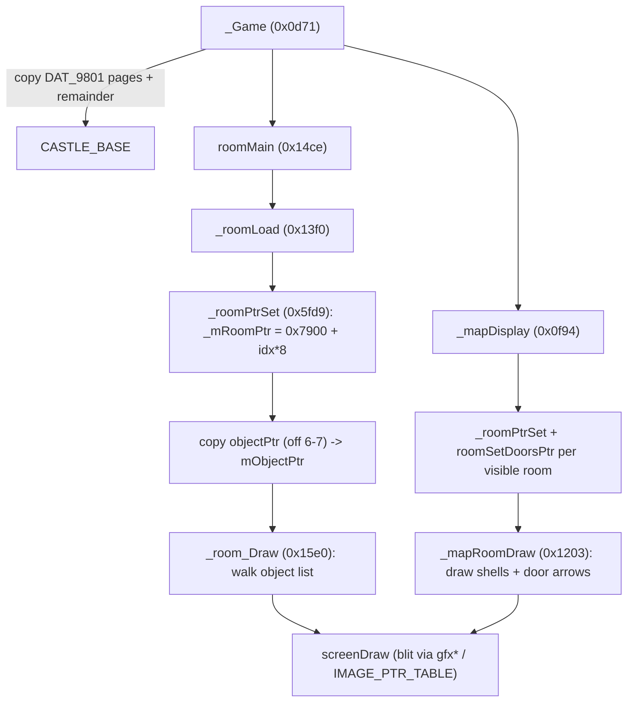

# The Castles of Dr. Creep — Room / Level Data Format

Reverse-engineered from the annotated 64K RAM dump (`C64_MEMORY_DUMP.BIN`) in Ghidra.
This document describes how a *castle* (level) is laid out in memory, how an individual
*room* record is encoded, how the per-room list of objects and the per-room list of doors
are stored, and how the load/draw pipeline turns that data into pixels on the C64 screen.

All addresses are hex and refer to functions/globals already named in the database.

---

## 1. The big picture

A castle is made of up to 32 **rooms**. The whole map fits on one screen at once
(the "map view"), and one room is shown enlarged during play. Each room owns:

- an 8-byte **room record** (in a fixed table),
- a variable-length **object list** (the static scenery/devices drawn in the room),
- a variable-length **door list** (entry/exit points that connect rooms).

Two pointers in the room record (`doorPtr`, `objectPtr`) reach the door and object lists,
which live elsewhere in the loaded castle image.



The disk loader places the castle image so that the room table sits at **0x7900**.
During the intro/attract mode the same code is reused with the table at **0x9900**
(a +0x2000 bias, see `_roomPtrSet` and the `Intros` flag).

---

## 2. From a room index to a room record — `_roomPtrSet` (0x5fd9)

A room is identified by a small integer index (0..31). `_roomPtrSet(index)` computes the
record address by multiplying the index by 8 and adding the table base:

```
_mRoomPtr (zp 0x42/0x43) = 0x7900 + (index << 3)        ; normal play
_mRoomPtr                = 0x9900 + (index << 3)        ; when Intros == 1
```

So **each room record is exactly 8 bytes**, and the table holds 32 records
(0x7900..0x79FF). `_mRoomPtr` is the 16-bit zero-page pointer (bytes 0x42 low / 0x43 high)
used by every room routine.

The "current room" comes from `CASTLE_BASE.current_room[player]`; `_roomLoad` (0x13f0)
selects the index for the active player (`CASTLE_BASE.current_room[_mPlayerStatus[0] != 1]`),
or `mMenuScreenCount` during the intro.

---

## 3. The room record (8 bytes)

Confirmed from the field accesses in `_roomLoad` (0x13f0), `_mapRoomDraw` (0x1203),
`roomSetDoorsPtr` (0x6009) and `_mapDisplay` (0x0f94).

| Offset | Field          | Size | Meaning |
|-------:|----------------|:----:|---------|
| 0      | `flagsAndColor`| 1    | Low nibble (bits 0–3) = room background color (0–15). High bits = map flags (see below). |
| 1      | `x`            | 1    | Room left edge, in the map's 4-pixel column units. |
| 2      | `y`            | 1    | Room top edge, in raster-line units (scanline). |
| 3      | `widthAndHeight`| 1   | Bits 0–2 = width in tiles, bits 3–5 = height in tiles. |
| 4–5    | `doorPtr`      | 2    | Little-endian pointer to this room's door list. |
| 6–7    | `objectPtr`    | 2    | Little-endian pointer to this room's object list. |

### `flagsAndColor` bit meanings

| Bits   | Name                  | Meaning |
|--------|-----------------------|---------|
| 0–3    | color                 | Room base color, replicated into many tile bitmaps by `_roomLoad`. |
| bit 6  | `_MAP_ROOM_VISIBLE`   | Room has been visited / is shown on the map. Set when a player enters (`_mapDisplay` ORs it in). `_mapRoomDraw` only draws rooms with this bit set. |
| bit 7  | `_MAP_ROOM_STOP_DRAW` | Sentinel: terminates the map draw loop in `_mapRoomDraw` (end-of-table marker). |

(`_mapRoomDraw` tests bit 7 first via `BIT 0x08c1`, then bit 6 via `BIT 0x08c0`; the two
bytes at 0x08c0/0x08c1 are the test masks for VISIBLE / STOP_DRAW.)



---

## 4. The object list — `_roomLoad` (0x13f0) + `_room_Draw` (0x15e0)

`_roomLoad` copies the room's `objectPtr` (offset 6–7) into the zero-page working pointer
`mObjectPtr` (zp 0x3e/0x3f). For the intro, +0x2000 is added to the high byte so the same
relative list is read from the intro copy.

`_room_Draw` then walks the list as **threaded code** (a list of subroutine pointers):



Disassembly of `_room_Draw` (0x15e0):

```
LDA (0x3e),Y      ; lo byte  -> patches operand of 'JSR $1601'
LDA (0x3e),Y      ; hi byte  -> patches high operand
... mObjectPtr += 2
LDA hi ; BEQ done ; hi == 0 terminates the list
JSR <patched>     ; call the object handler
```

So **each object entry begins with a 16-bit little-endian handler address.** The handler
itself reads however many *inline parameter bytes* it needs directly from `mObjectPtr`,
advancing the same pointer, and returns; `_room_Draw` then reads the next handler address.
A **high byte of 0x00 terminates the list.** This is a compact bytecode where the "opcode"
is literally the address of the routine that interprets the operands.

`obj_TextDraw` is a concrete example of the convention: it loops reading 4-byte records
(`x, y, color, font`) from `mObjectPtr`, advancing the pointer each time, stops on a 0
sentinel byte, then advances one more — i.e. the handler owns its own variable-length
parameter block.

Two parallel runtime arrays are populated for the active objects: `mRoomObjects[]`
(field `objNumber`) and `mRoomAnim[]` (8 bytes/object: `type`, `mFlags`, …). These are the
*live* per-room object instances; the object list above is the *recipe* that creates them.

---

## 5. The door list — `roomSetDoorsPtr` (0x6009)

`roomSetDoorsPtr(doorIndex)` loads the room's `doorPtr` (offset 4–5) into the zero-page
pointer `PTR_0040` (zp 0x40/0x41), reads the **first byte as a door count**
(`VAR_TEMP_PLAYER = doorPtr[0]`), then advances to the selected door:

```
PTR_0040 = doorPtr + 1 + (doorIndex << 3)
VAR_TEMP_PLAYER = doorPtr[0]      ; number of doors in this room
```

Layout:

```
doorPtr -> [ count ][ door 0 (8 bytes) ][ door 1 (8 bytes) ] ...
```

So **the door list is `1 + 8*count` bytes**: a count byte followed by 8-byte door records.

### Door record (8 bytes)

Confirmed from `_obj_Player_Add` (0x359e) and `_mapDisplay` / `_mapRoomDraw`:

| Offset | Field      | Meaning |
|-------:|-----------|---------|
| 0      | `x`       | Player spawn X inside the room (offset +6, or +11 for the special case). |
| 1      | `y`       | Player spawn Y inside the room (offset +15, or +12 for the special case). |
| 2      | `flags`   | Bits 0–1 = arrow/door direction (0=top, 2=bottom, 3=left, else=right). Bit 7 (0x80) = "special" spawn (player drawn blue, different spawn offsets, sets extra sprite fields). |
| 3      | —         | (not read by the analyzed routines) |
| 4      | —         | (not read by the analyzed routines) |
| 5      | `mapXoff` | X offset of the door's arrow within the room, used on the map view. |
| 6      | `mapYoff` | Y offset of the door's arrow within the room, used on the map view. |
| 7      | —         | (not read by the analyzed routines) |

`_obj_Player_Add` spawns the player at the door referenced by
`CASTLE_BASE.current_door[player]`: it positions the sprite at `door.x`/`door.y`
(plus fixed pixel offsets), and bit 0x80 selects the alternate (blue) spawn variant.

`_mapRoomDraw` iterates *all* doors of a room (`roomSetDoorsPtr(0)` then loops
`VAR_TEMP_PLAYER` times, stepping `PTR_0040 += 8`) and draws a directional arrow image for
each, using `flags & 3` to pick the arrow image and edge, and `mapXoff`/`mapYoff` to place it.

### How rooms connect

The analyzed code shows doors as *spawn/exit anchors* with a direction and a map arrow.
The actual "door N in room A leads to room B / door M" linkage is resolved when a player
walks through a door at run time: a sprite/object collision handler updates
`CASTLE_BASE.current_room[player]` and `CASTLE_BASE.current_door[player]`, after which
`_mapDisplay` → `roomMain` → `_roomLoad` re-loads the new room. The target-room/target-door
fields most likely live in the door record's unexamined bytes (offsets 3, 4, 7) and/or in
the door object's handler parameters, but I could not confirm their exact encoding from the
draw/spawn paths alone (see *Open questions*).

---

## 6. Drawing a room — `_mapRoomDraw` (0x1203) and `screenDraw`

`_room_Draw` (object list) draws the *contents* of a room during play. The room *shell*
(walls/borders) and the whole map overview are drawn by `_mapRoomDraw`, which walks the
entire room table from 0x7900:



Key globals driving every blit through `screenDraw`:

| Global          | Role |
|-----------------|------|
| `gfxPosX`       | Destination X (4-pixel column units; doubled internally for the bitmap). |
| `gfxPosY`       | Destination Y (raster line). |
| `gfxCurrentID`  | Index into `IMAGE_PTR_TABLE`; selects the source bitmap. |
| `pDecodeMode`   | Selects the blit path / source bank. |
| `mTxtX_0/mTxtY_0/pTxtCurrentID` | Parallel set used by the TEXT decode modes. |

`pDecodeMode` values seen:

| Mode | Used for |
|------|----------|
| `DECODE_MODE_GRAPHICS` | OR-blit a bitmap (interior tiles, sprites, time display). Reads `gfx*` globals and the `IMAGE_PTR_TABLE`. |
| `DECODE_MODE_TEXT_1`   | Border/edge strips (one of the room outline passes). |
| `DECODE_MODE_TEXT_2`   | Combined text+graphics path. |

`screenDraw` looks up the source image header via `IMAGE_PTR_TABLE` (a table of pointers
indexed by `gfxCurrentID*2`). Each image begins with a small `CreepIMG_Header`:

| Header byte | Field |
|-------------|-------|
| 0 | `widthInBytes` (source row stride) |
| 1 | `heightInPixels` |
| then | pixel rows (width × height) |

`screenDraw` converts `gfxPosX/gfxPosY` into a C64 hi-res bitmap address using
`TAB32_MULT_40_LOW/HIGH` (row → byte address tables), clips to the 40×25 char / 200-line
screen, and ORs the source bytes into the bitmap (graphics mode) or AND-NOTs them for the
text/erase mode. The room background color from `flagsAndColor & 0xf` is poked by
`_roomLoad` into the color/attribute bytes of many fixed `IMAGE_*_BITMAP` tiles so the room
takes on its theme color.

---

## 7. LEVEL_BASE → CASTLE_BASE — `_Game` (0x0d71)

At the start of a game (not a resume), `_Game` block-copies the disk-loaded level template
`LEVEL_BASE` into the live `CASTLE_BASE` structure:

```
PP_A = &LEVEL_BASE; PP_B = &CASTLE_BASE
for (pages = DAT_9801; pages != 0; pages--) copy 256 bytes
copy the remaining (LEVEL_SIZE & 0xff) bytes
```

i.e. the copy length is `DAT_9801` whole pages plus a remainder byte (`LEVEL_SIZE`).
After copying, `_Game` initializes the playable state from the template:

- `current_room[p] = start_room[p]`, `current_door[p] = start_door[p]` (per player)
- `active_player = 0`, `player_alive`, `player_color`, per-player timers, `room_exit_flag`
- `current_joystick = VAR_CHECKED_CONTROLLER`

So **LEVEL_BASE is the immutable castle definition** (room table image, door/object lists,
start positions, default colors); **CASTLE_BASE is the mutable running copy** that the game
mutates as players move, lose lives, and escape. `current_room`/`current_door` in CASTLE_BASE
are the indices fed back into `_roomPtrSet` / `roomSetDoorsPtr` to reach the room table and
door lists each frame.



---

## 8. Function reference (addresses analyzed)

| Address | Symbol | Role |
|---------|--------|------|
| 0x0d71 | `_Game` | Copies LEVEL_BASE→CASTLE_BASE, sets start room/door, main game loop. |
| 0x0f94 | `_mapDisplay` | Map overview screen; sets VISIBLE, draws player arrows, calls `_mapRoomDraw`. |
| 0x1203 | `_mapRoomDraw` | Walks room table @0x7900, draws each visible room shell + door arrows. |
| 0x13f0 | `_roomLoad` | Loads active room: selects index, applies color, copies objectPtr→mObjectPtr, calls `_room_Draw`. |
| 0x14ce | `roomMain` | Loads room, adds players, runs the in-room event loop. |
| 0x15e0 | `_room_Draw` | Threaded-code interpreter over the object list (handler-pointer pairs). |
| 0x2e1c | `events_Execute` | Per-tick: collisions, sprite + object execution. |
| 0x359e | `_obj_Player_Add` | Spawns a player sprite at `current_door` using the 8-byte door record. |
| 0x5fd9 | `_roomPtrSet` | index → `_mRoomPtr` = 0x7900 (or 0x9900) + index*8. |
| 0x6009 | `roomSetDoorsPtr` | doorIndex → `PTR_0040` = doorPtr+1+index*8; sets door count. |
| 0x58xx | `screenDraw` | Clipped bitmap blit; reads gfx*/txt* globals and IMAGE_PTR_TABLE. |

Zero-page pointers: `_mRoomPtr` = 0x42/0x43, `mObjectPtr` = 0x3e/0x3f, door pointer
`PTR_0040` = 0x40/0x41.

---

## 9. Open questions / limits

These are honest limits given a read-only call-graph navigation (no raw memory/strings/xref
access — the layout below is inferred purely from how code *indexes* the data):

1. **Exact door→target-room linkage.** The draw and spawn paths only read door bytes 0,1,2,5,6.
   Bytes 3, 4, 7 of each door record are not touched by the analyzed routines, so I cannot
   confirm where the *destination room index* and *destination door index* are stored. They are
   most plausibly in those unread bytes (or supplied by the door object's handler in the object
   list). Confirming this needs the run-time door-collision/transition handler reached through
   `object_Execute` (inside `events_Execute`), which I did not fully trace.

2. **`flagsAndColor` bit 4/5 semantics.** Only color (bits 0–3), VISIBLE (bit 6) and
   STOP_DRAW (bit 7) were observed in use. Any meaning of bits 4–5 is unconfirmed.

3. **Absolute base of the door/object lists.** I confirmed the *pointers* (room offsets 4–5
   and 6–7) and that the intro path biases the high byte by +0x20 (objects) / works off 0x9900
   (rooms). The concrete on-disk addresses of the per-castle door/object blobs depend on the
   loaded image and were not read directly.

4. **`widthAndHeight` upper bits.** Bits 0–2 (width) and 3–5 (height) are read by `_mapRoomDraw`.
   Bits 6–7 are masked off and their meaning, if any, is unknown.

5. **Threaded-code opcode set.** `_room_Draw` calls arbitrary handler addresses; I documented the
   mechanism and one handler (`obj_TextDraw`) as the canonical "consume your own inline params"
   pattern, but I did not enumerate every object handler or its parameter layout.
