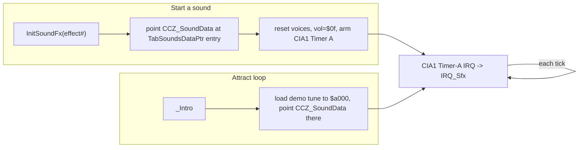
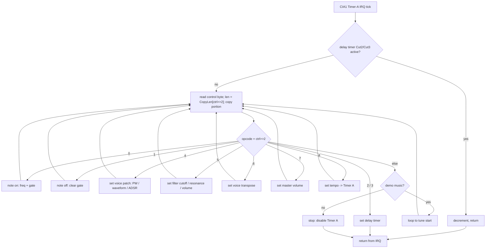

# The Castles of Dr. Creep — Sound & Music

The SID audio engine, reconstructed from `Creep Sourcecode/asm/object.asm` (the sound routines
around lines 11446–11760) and `Creep Sourcecode/inc/CC_DataSounds.asm` (the effect data). Line
numbers are into `object.asm`.

> As with the other docs, the reconstructed source ("Dr Creep 3") and the Ghidra dump are different
> builds — behaviour identical, addresses differ. Everything here is taken from the source, which is
> byte-exact.

---

## 1. One interpreter, two uses

There is a **single byte-code interpreter**, `IRQ_Sfx` (11446), that plays a stream pointed to by
`CCZ_SoundData`. That stream is **either**:

- a **sound effect** (pointer from `TabSoundsDataPtr`, started by `InitSoundFx`), or
- the **demo/attract music** (loaded from disk to `CCL_MusicDataStart`, the `$a000` "Demo Music"
  region in the memory map).

Same format, same interpreter — the source even comments the data pointer as "sound effect / demo
music". They are **mutually exclusive**: `InitSoundFx` refuses to start an effect while demo music
is playing (`CCW_DemoFlag == DemoYes`), so music owns the SID during the attract loop and effects
own it during play.

Playback is **interrupt-driven by CIA #1 Timer A** — not the raster. The timer period
(`$DC05` `TIMAHI`) sets the tick rate; each timer IRQ runs `IRQ_Sfx` to advance the stream. Effects
and music therefore keep playing independently of the game's frame loop.

---

## 2. SID model

The C64 SID (`$D400`) has **3 voices** and a global filter/volume block:

| Voice | Regs | Freq | PW | Control | ADSR |
|-------|------|------|----|---------|------|
| 1 | `$D400–$D406` | `$D400/01` | `$D402/03` | `$D404` (`VCREG1`) | `$D405/06` |
| 2 | `$D407–$D40D` | `$D407/08` | … | `$D40B` (`VCREG2`) | … |
| 3 | `$D40E–$D414` | `$D40E/0F` | … | `$D412` (`VCREG3`) | … |

Global: `$D415/16` filter cutoff (`CUTLO/CUTHI`), `$D417` resonance + routing (`RESON`), `$D418`
volume + filter mode (`SIGVOL`). The control-register bit 0 is the **gate** (note on/off).

The engine keeps a **RAM shadow** of every SID register (`TabSidVoicesData`, `TabSidVolume`,
`TabSidRes`, `TabSidCut*`). Every write goes to **both** the hardware (`CCZ_SidVoiceAdr`) and the
shadow (`CCZ_SidVoiceVal`) so read-modify-write ops (e.g. flipping the gate bit without disturbing
the waveform) work correctly. `IRQ_NextVoice` (11665) selects the target voice's address+shadow
pair from `control & 3`.

---

## 3. Stream format & opcodes

The stream is a series of variable-length **portions**. For each one `IRQ_Sfx`:

1. reads the first byte = **control byte**;
2. uses `control >> 2` to index `TabTune2PlayCopyLen` → the portion **length**;
3. copies that many bytes into the `TabTune2Play` work buffer and advances `CCZ_SoundData`;
4. **dispatches on `control >> 2`** (the opcode), with **`control & 3` = the voice** (0–2).

Delays are explicit: opcodes 2/3 load the `Tune2PlayCtrlCut2/Cut3` countdown timers; while those are
nonzero the interpreter returns early each tick, so a note or rest lasts a programmed number of
ticks before the next portion is read.

| Opcode (`ctrl>>2`) | Name | Effect |
|:---:|------|--------|
| **0** | Note on | write voice freq lo/hi (from `Tune2PlayCutLo` + per-voice offset) to the SID oscillator + shadow, then set gate bit (`ora #$01`) → note starts |
| **1** | Note off | clear gate bit (`and #$fe`) → note enters release |
| **2** | Delay (short) | `Tune2PlayCtrlCut2 = CutLo` — wait N ticks |
| **3** | Delay (long) | `Tune2PlayCtrlCut3 = CutLo` — wait N ticks |
| **4** | Set voice patch | copy pulse-width / control(waveform) / ADSR bytes into the voice's SID regs (preserving the current gate bit) — i.e. select the instrument |
| **5** | Set filter | cutoff `$D415/16`, resonance `$D417` (with per-voice routing via `TabSelectABit[voice]`), and volume `$D418` |
| **6** | Voice transpose | set this voice's frequency offset `Tune2PlayCutLo[voice]` (used to pitch notes) |
| **7** | Master volume | low nibble of `$D418` |
| **8** | Tempo | `Tune2PlayTime → $DC05` (`time*4 | 3`) — change the CIA timer rate = playback speed |
| *else* | End | **music:** loop back to `CCL_MusicDataStart`; **effect:** stop (disable CIA1 Timer A: `CIACRA=0`, `CIAICR=$7f`) |

---

## 4. Sound effects (`CC_DataSounds.asm`)

`TabSoundsDataPtr` lists 13 effects; each is a short tune-stream that plays once and self-terminates
(the *End* opcode disables the timer). In order (`NoSnd*` = index):

| # | Symbol | Trigger |
|:-:|--------|---------|
| 0 | `SndGunShot` | ray-gun fires |
| 1 | `SndTrapSwitch` | trap-door switch thrown |
| 2 | `SndForcePing` | force field closing (periodic ping) |
| 3 | `SndOpenDoor` | door opening |
| 4 | `SndMaTrXmit` | matter transmitter: teleport |
| 5 | `SndMaTrSelect` | matter transmitter: cycle receiver |
| 6 | `SndLiMacSwitch` | lightning-machine switch |
| 7 | `SndFrankOut` | Frankenstein leaves coffin |
| 8 | `SndDeath` | player / mummy / Frank death |
| 9 | `SndMapPing` | entering the map |
| 10 | `SndWalkSwitch` | moving-sidewalk switch |
| 11 | `SndMummyOut` | mummy emerges from tomb |
| 12 | `SndKeyPing` | key picked up |

Some effects expose a **`*Tone` byte** that gameplay patches at runtime to pitch-shift the sound —
e.g. `SFX_GunShotTone`, and `SFX_MummyOutTone`, which `MoveMummySprite` recomputes each emergence
step (`Work*4 + height`) so the mummy's rise sweeps upward in pitch. A gunshot, for instance, sets
voice 0 to the **noise** waveform (`$80`) with a fast ADSR — a burst of noise rather than a tone.

### Starting an effect — `InitSoundFx(A = effect#)` (11706)
1. Bail if demo music is playing (music has the SID).
2. `CCZ_SoundData = TabSoundsDataPtr[A]`.
3. Silence the three control regs, set volume `$0f`, default cut/tempo.
4. **Arm CIA #1 Timer A** (`TIMAHI`, `CIAICR=$81`, `CIACRA=$01`) so the IRQ starts feeding the
   effect. It runs to its *End* opcode, which disables the timer — one-shot playback.

---

## 5. Demo / attract music

The attract loop (`_Intro`) cycles through disk music files (`TabDemoMusicFile`, incrementing the
song number and wrapping at the max) and loads each to `CCL_MusicDataStart` (`$a000`). It sets
`CCW_Tune2PlayDemo = Yes`, calls `InitTuneVoices` (11687, gates all three voices off), and lets the
same `IRQ_Sfx` engine play the stream. At the stream's *End* opcode the demo path **loops back to
the tune start** instead of stopping, so the music repeats until the player presses fire — which
clears the demo flag and silences the voices.

---

## 6. At a glance

- **Driver:** CIA #1 Timer A interrupt → `IRQ_Sfx`; rate = `TIMAHI` (opcode 8 changes tempo).
- **Format:** stream of `control`-byte portions; `opcode = ctrl>>2`, `voice = ctrl&3`; length table
  `TabTune2PlayCopyLen`.
- **Opcodes:** note-on/off, two delays, voice-patch, filter, transpose, volume, tempo, end/loop.
- **Effects:** 13 one-shot streams in `CC_DataSounds.asm`, some pitch-patched at runtime.
- **Music:** disk-loaded to `$a000`, same engine, loops; effects are suppressed while it plays.
- **SID:** 3 voices + global filter/volume, mirrored in a RAM shadow so gate toggles are non-destructive.

### Open questions / limits
- Individual effect byte streams are documented by *format and trigger*, not decoded note-by-note.
- Exact `TabTune2PlayCopyLen` values (per-opcode portion lengths) and the `TabTune2PlayVocAdr`
  oscillator-address table are read from the source symbolically; they weren't dumped as literals.
- Rendering the audio to `.wav`/`.sid` would need a SID emulation pass and is out of scope here.
