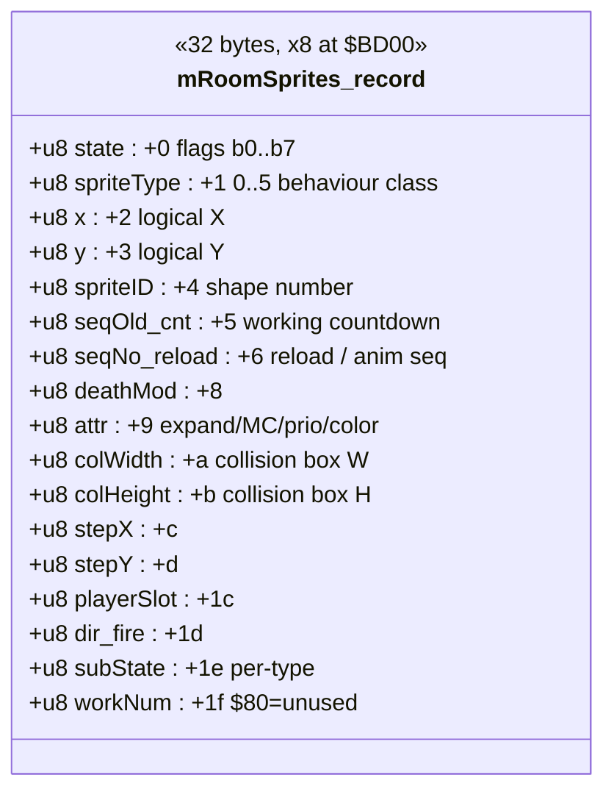
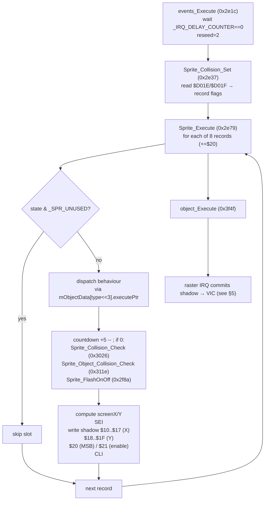
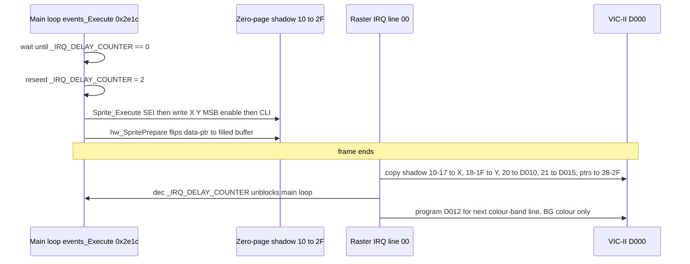
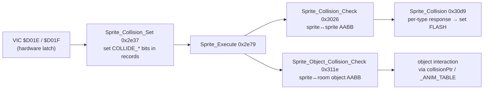

# The Castles of Dr. Creep — Sprite System

This document explains how *The Castles of Dr. Creep* manages on-screen sprites:
the logical-sprite data structures, how logical sprites are mapped onto the eight
VIC-II hardware sprites, how shapes/colours are uploaded, how collisions are
detected, and the role of the raster IRQ.

It is based on the annotated 64K RAM dump in Ghidra (`C64_MEMORY_DUMP.BIN`),
cross-checked against the reconstructed assembly source in
`Creep Sourcecode/asm/object.asm` and the equates in `Creep Sourcecode/inc/`.

> **TL;DR — there is no mid-frame sprite multiplexer.**
> The game uses a strict **1:1 logical → hardware** mapping (8 logical sprites,
> 8 hardware sprites). The only "multiplexing" trick is a **per-frame, IRQ-driven
> atomic commit** of a zero-page shadow copy of the VIC sprite registers, plus
> **double-buffered sprite shape storage** to avoid tearing. The raster IRQ does
> *not* rewrite sprite position registers part-way down the screen — it writes
> them once, at the top of the frame. Evidence for this is given in
> [§5](#5-the-raster-irq-frame-sync-not-a-multiplexer).

---

## 1. Key addresses analysed

| Symbol (Ghidra)                | Address  | Source label (`object.asm`) | Role |
|--------------------------------|----------|-----------------------------|------|
| `events_Execute`               | `0x2e1c` | main tick                   | Per-frame entry: waits for IRQ sync, runs collision/sprite/object passes |
| `Sprite_Collision_Set`         | `0x2e37` | —                           | Reads VIC hardware collision latches into the logical sprite records |
| `Sprite_Execute`               | `0x2e79` | (sprite handler loop)       | Per-frame: animate/move each logical sprite, write VIC shadow regs |
| `Sprite_FlashOnOff`            | `0x2f8a` | `AnimateDeath`/flash         | Death-flash colour toggle |
| `Sprite_Collision_Check`       | `0x3026` | —                           | Software sprite↔sprite bounding-box test |
| `Sprite_Collision`             | `0x30d9` | —                           | Sprite↔sprite collision response (dispatch per type) |
| `Sprite_Object_Collision_Check`| `0x311e` | —                           | Software sprite↔room-object bounding-box test |
| `object_Execute`               | `0x3f4f` | —                           | Per-frame room-object pass |
| `_Sprite_CreepGetFree`         | (`GetNewSpriteWA`) | `GetNewSpriteWA`  | Allocate a free logical-sprite slot |
| `hw_SpritePrepare`             | (`CopySpriteData`) | `CopySpriteData`  | Upload a sprite shape + set colour/expand/multicolor/priority |
| `IRQ` raster handler           | (`IRQ`)  | `IRQ`                       | Commits the VIC shadow to real registers once per frame |

Data anchors:

| Symbol | Address | Notes |
|--------|---------|-------|
| `mRoomSprites[]` | `$BD00` | 8 records × `$20` bytes (`$BD00..$BDFF`) |
| `_IRQ_DELAY_COUNTER` (`CCW_CountIRQs`) | `$2E35` | Decremented by the raster IRQ; used for frame sync |
| `mEngine_Ticks` | `$2E36` | Free-running frame counter |
| State-flag mask constants | `$0883..$0889` | One byte per `BIT`-tested flag mask |
| `CONST_BITMASK_TAB` (`TabSelectABit`) | `$2F82` | `1<<n` for `n = 0..7` |
| VIC sprite-register **shadow** (zero page) | `$10..$2F` | Copied to VIC by the IRQ (see §5) |

---

## 2. The logical sprite record — `mRoomSprites[]`

There are **8** logical sprite "work areas" at `$BD00`, each **`$20` (32) bytes**
long (`CC_SprWALen = $20`, `CC_SprWAMax = $08`). Because the record stride is
`$20`, the engine indexes records by adding `$20` to the X register and detecting
wrap-around to `$00` to terminate the loop over all 8 — this is the recurring
`index += 0x20; if (index == 0) break;` pattern seen throughout `Sprite_Execute`,
`Sprite_Collision_Set`, etc.

A direct consequence: the **hardware sprite number is the record offset shifted
right by 5** (`offset >> 5`, i.e. `/32`). Five `LSR`s appear in both
`Sprite_Execute` (`0x2efe`) and `CopySpriteData` to turn the byte offset
`$00,$20,$40,…,$E0` into the sprite number `0,1,2,…,7`. That is the meaning of the
`>> 5` you see in the decompiler, and of the `& CONST_BITMASK_TAB[n]` accesses
(`1<<n` for sprite `n`).

### 2.1 Record layout

Offsets are relative to the start of a 32-byte record (`CC_WaS_*` in
`inc/CC_WorkAreas.asm`). Ghidra field names are given where they differ.

| Off | Source field           | Ghidra field                     | Meaning |
|-----|------------------------|----------------------------------|---------|
| `+0`| `CC_WaS_SpriteFlag`    | `state`                          | State / collision flag bits (see §2.2) |
| `+1`| `CC_WaS_SpriteType`    | `spriteType`                     | Behaviour class: 0 Player, 1 Spark, 2 Force, 3 Mummy, 4 Beam, 5 Frank |
| `+2`| `CC_WaS_SpritePosX`    | `x`                              | Logical X (character/grid units, ×2 − 8 → pixels) |
| `+3`| `CC_WaS_SpritePosY`    | `y`                              | Logical Y (+ `$32` → raster Y) |
| `+4`| `CC_WaS_SpriteNo`      | `spriteID` / image no.           | Shape number (index into `TabSpriteDataPtr`) |
| `+5`| `CC_WaS_SpriteSeqOld`  | `collisionCheckCounter`          | Working countdown; reloaded from `+6` each cycle |
| `+6`| `CC_WaS_SpriteSeqNo`   | `collisionCheckInitCounter`      | Reload value / animation sequence number |
| `+8`| `CC_WaS_SpriteDeath`   | `flashDuringDeathCounter` (rel.) | Death-tune / death-flash modifier |
| `+9`| `CC_WaS_SpriteAttrib`  | attr                             | `b7`X-expand `b6`Y-expand `b5`spr/BG-prio `b4`multicolor `b3-0`colour |
| `+a`| `CC_WaS_SpriteCols`    | `collisionWidth` (rel.)          | Width (columns ×4 = pixels), used for collision box |
| `+b`| `CC_WaS_SpriteRows`    | `collisionHeight` (rel.)         | Height (rows = pixels), used for collision box |
| `+c`| `CC_WaS_SpriteStepX`   | —                                | Next/step X |
| `+d`| `CC_WaS_SpriteStepY`   | —                                | Next/step Y |
| `+1c`| `CC_WaS_PlayerSpriteNo`| (player → slot)                 | Player number / `SPRITE_INDEX_FOR_PLAYER` link |
| `+1d`| `CC_WaS_SpriteMoveDir`/`JoyActn` | —                       | Joystick direction / fire (type-dependent) |
| `+1e`| status/dir (overloaded)| —                               | Per-type sub-state (Mummy in/out/dead, Frank, Force, RayGun ptr) |
| `+1f`| `CC_WaS_SpriteWrk`/`NumWA`| —                            | Work field / WA number (`$80` = unused) |

> Note on `+5`/`+6`: the reconstructed source names these `SeqOld`/`SeqNo`
> (animation sequence). At runtime the engine uses `+5` as a working countdown
> that is reloaded from `+6` at the end of each per-sprite cycle
> (`Sprite_Execute` `0x2e95`: `DEC $BD05,X`; `0x2f6c`: `LDA $BD06,X / STA $BD05,X`).
> Ghidra's annotator therefore labelled them `collisionCheckCounter` /
> `…InitCounter` after their *use*. Both views describe the same two bytes.

### 2.2 State / collision flag bits (`+0`)

The flag byte mixes lifecycle state and collision results. The single-bit mask
constants live at `$0883..$0889` and are tested with `BIT`.

| Bit  | Value | Source name (`CC_WaS_Flag*`) | Ghidra name        | Meaning |
|------|-------|------------------------------|--------------------|---------|
| —    | `$00` | `FlagActive`                 | (active)           | Record holds valid data |
| `b0` | `$01` | `FlagInactive`               | `_SPR_UNUSED`      | Slot free / not in use |
| `b1` | `$02` | `FlagCollS_S`                | `SPR_COLLIDE_SPRITE` | Sprite↔sprite collision occurred this frame |
| `b2` | `$04` | `FlagCollS_B`                | `SPR_COLLIDE_BACKGROUND` | Sprite↔background collision occurred |
| `b3` | `$08` | `Flag08`                     | `SPR_ACTION_FREE`  | Marked for release (→ becomes `Inactive`) |
| `b4` | `$10` | `FlagAction`                 | `SPR_ACTION_FLASH` | Pending action / death-flash in progress |
| `b5` | `$20` | `FlagDeath`                  | `SPR_ACTION_DIEING`| Mortal sprite, dying |
| `b6` | `$40` | `FlagDead`                   | `SPR_ACTION_DESTROY` | Death mark / destroy |
| `b7` | `$80` | `FlagInit`                   | `SPR_ACTION_CREATED` | Just initialised |



---

## 3. Per-frame sprite pipeline (`Sprite_Execute`, `0x2e79`)

`events_Execute` (`0x2e1c`) is the heartbeat. It busy-waits until the raster IRQ
has zeroed `_IRQ_DELAY_COUNTER` (`$2E35`), reseeds it to `2`, then runs three
passes in order:

1. `Sprite_Collision_Set` — latch VIC hardware collisions into the records.
2. `Sprite_Execute`       — animate + position every logical sprite.
3. `object_Execute`       — room-object logic.

`Sprite_Execute` walks all 8 records (`index += 0x20`). For each record that is
**not** `_SPR_UNUSED` it:

- dispatches per-type behaviour via a code pointer in `mObjectData[].executePtr`
  selected by `spriteType << 3` (self-modifying `JMP` at `0x2ee8/0x2ee9`);
- decrements the `+5` countdown; when it expires it runs collision checks
  (`Sprite_Collision_Check`, `Sprite_Object_Collision_Check`) and/or the
  death-flash (`Sprite_FlashOnOff`) depending on the flag bits, then reloads the
  countdown from `+6`;
- finally, if the slot is alive and not flagged free, it **computes the hardware
  position and writes the zero-page VIC shadow** (the actual VIC registers are
  written later by the IRQ — §5):

```
screenX = (logicalX * 2) - 8        ; 9-bit, low byte → $10+n, high → MSB at $20
screenY =  logicalY + $32           ; → $18+n
```

The X computation is a 16-bit shift/subtract using zero-page `$30/$31`, then:

- `STA $10,Y` writes the per-sprite **X shadow** (`$10..$17`, Y = sprite no.);
- the X MSB (bit 8) is OR/AND-ed into the **MSB shadow** `$20` via
  `CONST_BITMASK_TAB[n]`;
- off-screen sprites (MSB set and `X ≥ $58`/`$57`) are **disabled** by clearing
  their bit in the **enable shadow** `$21`;
- on-screen sprites write `STA $18,Y` (Y shadow) and **enable** their bit in `$21`.

Crucially this update is bracketed by **`SEI` … `CLI`** (`0x2f28`/`0x2f6b`). The
position, MSB and enable shadows form a logically-coupled set; the IRQ consumer
must never observe a half-updated shadow, so interrupts are masked across the
update. This is the strongest single piece of evidence that the IRQ is the
register *consumer*.



---

## 4. Hardware-sprite setup & slot allocation

### 4.1 `_Sprite_CreepGetFree` / `GetNewSpriteWA` — slot allocation

```
in : -
out: X = WA offset ($00,$20,$40,$60,$80,$A0,$C0,$E0); carry clear = success
```

It scans the 8 records (`X += $20`, wrap at `$00`). A slot is **free** when its
`FlagInactive` ($01) bit is set. The first free slot is zeroed (`$20` bytes),
marked `FlagInit` ($80), and its `+5/+6` sequence bytes seeded to `1`. On failure
(no free slot) it returns with carry **set**.

The returned value is a **byte offset**, not a sprite number — callers convert to
the hardware sprite number with `offset >> 5` (the five `LSR`s) and to a per-sprite
bit with `CONST_BITMASK_TAB[offset >> 5]`. This is the `>>5` / `&` bit-twiddling
referenced in the brief.

### 4.2 `hw_SpritePrepare` / `CopySpriteData` — shape & attribute upload

```
in : X = WA offset of the logical sprite (record holds spriteID/attr/etc.)
```

Steps:

1. Look up the shape: `spriteID * 2` indexes `TabSpriteDataPtr` to get a pointer
   to the shape definition (a small header `{attr, cols, rows}` followed by packed
   shape bytes).
2. Store the header byte into the record's `attr` (`+9`); cache cols (`*4` →
   pixels) and rows into `+a`/`+b` for collision boxes.
3. Compute the sprite number `n = offset >> 5`.
4. **Double-buffer the shape data (anti-flicker).** Each hardware sprite has two
   alternate shape slots in screen RAM. The code reads the *current* sprite data
   pointer shadow (`CCZ_SpritesDataPtr,n` at `$28+n`), `EOR #$08` to select the
   **other** slot, expands `slot << 6` to a byte address, and copies the freshly
   decoded shape (3 bytes/row × up to 21 rows, zero-filled) into that idle slot.
5. Only after the copy is complete does it flip the **data-pointer shadow** to
   point at the just-filled slot (`EOR #$08` again, store to `$28+n`). The IRQ
   then publishes the new pointer next frame. Writing to the idle buffer first
   means the VIC never reads a partially-written shape → no tearing.
6. Set the **colour** directly: `SP0COL,n` (`$D027+n`) from `attr & $0F`.
7. Set/clear the per-sprite bit (via `TabSelectABit,n`) in the VIC attribute
   registers **directly** (these are not shadowed): X-expand `$D01D`, Y-expand
   `$D017`, sprite/BG priority `$D01B`, multicolor `$D01C`.

So attributes and colour are written straight to the VIC; only **position, MSB,
enable, and the shape data-pointer** are routed through the zero-page shadow and
committed by the IRQ.

---

## 5. The raster IRQ: frame sync, **not** a multiplexer

The IRQ handler (`IRQ` in `object.asm`, hooked through the CPU IRQ vector) is a
combined raster + CIA-timer (SFX) handler. On a **raster** interrupt it:

1. Acknowledges `$D019`.
2. Indexes `TabRasterColorPos` by `CCW_RasterColorNo` to set `$D021` (background
   colour) — used to draw horizontal colour bands on the *castle-escape exit
   screen* only.
3. **If `RasterColorNo == 0` (the first IRQ of the frame, raster line `$00`)**, it
   runs the `.MoveSprites` block, which copies the entire zero-page shadow into the
   VIC in one unrolled burst:

   | Shadow (zero page) | → VIC register | Meaning |
   |--------------------|----------------|---------|
   | `$10..$17` | `$D000,$D002,…,$D00E` | Sprite 0..7 X |
   | `$18..$1F` | `$D001,$D003,…,$D00F` | Sprite 0..7 Y |
   | `$20`      | `$D010` | X MSBs |
   | `$21`      | `$D015` | Sprite enable |
   | `$22`      | `$D018` | VIC memory control |
   | `$24`      | `$D020` | Border colour |
   | `$26`      | `$D016` | Control reg 2 |
   | `$28..$2F` | sprite data pointers in screen RAM | Shape pointers (double-buffered) |

4. Decrements `_IRQ_DELAY_COUNTER` (`$2E35`) — the value `events_Execute`
   busy-waits on, providing main-loop ↔ IRQ frame synchronisation.
5. Programs `$D012` for the **next** raster line in the table and increments
   `RasterColorNo`.

The additional raster compares in `TabRasterColorPos` (`$A2`, `$CA`, `$D2`) only
change `$D021` to paint colour bands; **they never touch the sprite position,
enable or MSB registers.** The full sprite register set is written exactly once
per frame, at the top. Therefore:

- **This is not a mid-frame sprite multiplexer.** No hardware sprite is reused at a
  different Y position later in the same frame.
- The mapping is fixed **1 logical sprite → 1 hardware sprite** (record `n` ↔
  hardware sprite `n = offset>>5`). Sprites that would fall off-screen are simply
  disabled in the enable shadow (§3) rather than reassigned.
- The "tricks" that make it robust are (a) the **atomic IRQ commit** of a coherent
  shadow (built under `SEI`/`CLI`) so the VIC always sees a consistent frame, and
  (b) **double-buffered shape data** so shape changes don't tear.



---

## 6. Collision detection

The game uses **both** the VIC-II hardware collision latches **and** software
bounding-box tests — the hardware latch is used as a cheap "did *anything*
collide?" pre-filter, and the software pass resolves *which* objects and the
response.

### 6.1 `Sprite_Collision_Set` (`0x2e37`) — read the VIC hardware latches

At the start of every frame it snapshots the two VIC collision registers into work
bytes and distributes the bits to the per-sprite records:

| VIC register | Snapshot (`SPOX`) | Meaning |
|--------------|-------------------|---------|
| `$D01E`      | `_MM` → `VAR_VIA_MM` | Sprite-to-sprite collision (one bit per sprite) |
| `$D01F`      | `MD`  → `VAR_VIA_MD` | Sprite-to-background collision (one bit per sprite) |

It walks the 8 records; for each *active* record it shifts one bit out of each
snapshot. A set sprite-sprite bit sets `SPR_COLLIDE_SPRITE` ($02) in the record's
state; a set sprite-background bit sets `SPR_COLLIDE_BACKGROUND` ($04). (Reading
`$D01E/$D01F` clears them, so they must be latched once per frame — which is why
this runs first in `events_Execute`.)

### 6.2 Software bounding boxes — `Sprite_Collision_Check` (`0x3026`)

For sprites whose hardware bit indicated a collision, this does an **axis-aligned
bounding-box overlap test** in logical coordinates against every *other* active
sprite. The box is `[x, x+colWidth] × [y, y+colHeight]` (fields `+a`/`+b`), with
carry-clamping so wrap-around can't produce false overlaps. Type compatibility is
gated by `mObjectData[].mFlashData` (a per-type collision mask) so e.g. two
mummies don't "collide". On a real overlap it calls `Sprite_Collision`
(`0x30d9`) **twice** (both orderings), which dispatches a per-type response via
`mObjectData[].spriteCollisionPtr` and typically sets `_SPR_ACTION_FLASH` to start
the death sequence.

### 6.3 Sprite ↔ room object — `Sprite_Object_Collision_Check` (`0x311e`)

Same bounding-box approach, but tests the sprite against the room's static/animated
objects (`mRoomAnim[]`, fields `mX/mY/mWidth/mHeight`, skipping objects flagged
`_ITM_DISABLE`). Behaviour on overlap is driven by `mObjectData[].collisionPtr`
and the `_ANIM_TABLE` entry for the object type (e.g. picking up a key, triggering
a trap). This is how the player interacts with doors, keys, force fields, etc.



---

## 7. Summary of the logical → hardware mapping

| Concern             | Mechanism |
|---------------------|-----------|
| Logical sprites     | 8 records × 32 bytes at `$BD00`; indexed by `offset` in steps of `$20` |
| Sprite number       | `n = offset >> 5` (0..7); per-sprite bit = `CONST_BITMASK_TAB[n]` (`1<<n`) |
| Mapping             | Fixed **1:1** record↔hardware sprite; no reuse within a frame |
| Position write      | Main loop → zero-page shadow `$10..$21` under `SEI`/`CLI` |
| Position commit     | Raster IRQ copies shadow → VIC `$D000..$D015` once per frame (top) |
| Shapes              | `hw_SpritePrepare` decodes shape into a double-buffered slot, flips ptr |
| Attributes/colour   | Written directly to `$D017/$D01B/$D01C/$D01D/$D027+n` by `hw_SpritePrepare` |
| Allocation          | `_Sprite_CreepGetFree` finds a slot with `FlagInactive`, returns its offset |
| Collision           | Hardware latch (`$D01E/$D01F`) pre-filter + software AABB resolution |

---

## 8. Open questions / limits

- **Raw data tables not byte-read.** The available Ghidra endpoints decompile only
  *code inside defined functions*, so the contents of `mObjectData[]`,
  `TabSpriteDataPtr`, `CONST_BITMASK_TAB`/`TabSelectABit` (`$2F82`) and the
  flag-mask bytes at `$0883..$0889` were inferred from the **access patterns** and
  confirmed against the reconstructed source, not dumped directly from the binary.
  The exact pointer values in `mObjectData[].executePtr/collisionPtr/...` are not
  reproduced here.
- **Source vs. dump drift.** The reconstructed `object.asm` is an extremely close
  match to the dump (identical instruction sequences for the routines analysed),
  but it is not guaranteed byte-identical to the specific build in
  `C64_MEMORY_DUMP.BIN`. Where Ghidra field names (`collisionCheckCounter`) and
  source names (`SeqOld/SeqNo`) for record bytes `+5/+6` disagree, both are noted;
  the runtime behaviour (countdown reloaded from `+6`) is taken from the dump's
  disassembly and is authoritative.
- **`hw_SpritePrepare` / `_Sprite_CreepGetFree` addresses.** These are reachable
  via `CopySpriteData` / `GetNewSpriteWA` in the source but were not pinned to a
  specific dump address through the call-graph endpoints available here; the
  behaviour was verified by decompiling the routines that *call into* the same VIC
  shadow / data-pointer flip logic. Their absolute addresses in the dump are not
  asserted.
- **Double-buffer base addresses.** The two shape slots per sprite live in screen
  RAM at the addresses the source comments give (`$0800`-region pairs flipped by
  `EOR #$08` then `<<6`); exact final addresses depend on the active VIC bank,
  which was not separately confirmed from the dump.
- **No second sprite "tier".** Because the mapping is strictly 1:1 and the IRQ
  writes registers only at the top of the frame, the game is hard-limited to 8
  simultaneous on-screen sprites. There is no evidence of any raster-split scheme
  to exceed this.
