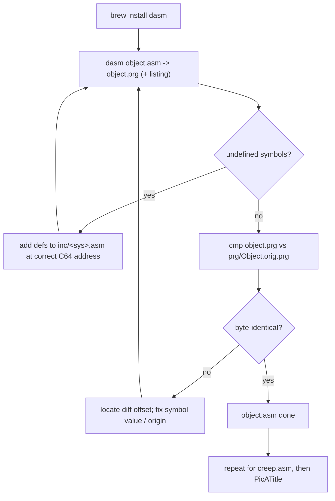

# Design — Make the reconstructed source assemble (byte-exact)

**Date:** 2026-08-10
**Status:** approved for planning

## Goal

Make `Creep Sourcecode/` assemble on this machine to binaries that are **byte-identical to the
original `.prg` files** shipped in `Creep Sourcecode/prg/`. The reconstruction is complete *except*
for seven C64 system-definition include files it `include`s but that are absent from the repo.
Authoring those includes (and a macOS build) is "creating the missing source."

## Background / current state

- `asm/object.asm` (engine, `* = $0800`) and `asm/creep.asm` (loader/title) each `include`:
  `cia1.asm`, `cia2.asm`, `sid.asm`, `vic.asm`, `kernel.asm`, `color.asm`, `mem.asm` — via
  `incdir ..\inc`. **None of these exist anywhere in the repo.**
- They also `include inc\CC_*.asm` (present) for the game's own vars/data.
- Verification targets already in the repo: `prg/Object.orig.prg` (28 KB), `prg/Creep.orig.prg`
  (561 B), `prg/PicATitle.orig.prg` (9.8 KB).
- `asm.bat` invokes DASM at a hardcoded Windows path; DASM is not installed here.
- Paths in the source use **backslashes** (`incdir ..\inc`, `include inc\CC_VarsGame.asm`) — a
  portability hazard on a Unix DASM build (see Risks).

## Acceptance criteria

1. `object.asm` assembles with no errors and its output **byte-matches `prg/Object.orig.prg`**.
2. `creep.asm` assembles and byte-matches `prg/Creep.orig.prg`.
3. `PicATitle` assembles and byte-matches `prg/PicATitle.orig.prg`.
4. A single command on macOS reproduces all three from a clean checkout.
5. Any residual byte divergence is **documented** (offset + cause), not hidden — if the
   reconstruction genuinely differs from an `.orig.prg`, that is reported, not forced.

## Approach — iterative bring-up (chosen)

1. `brew install dasm`.
2. Attempt to assemble `object.asm`; DASM reports undefined symbols.
3. Define each undefined symbol in the appropriate new `inc/<sys>.asm` at its correct C64
   address/value, using the classic Commodore label set the source already assumes
   (e.g. `SCROLY=$D011`, `SPENA=$D015`, `SP0COL=$D027`, `SIGVOL=$D418`, `TIMAHI=$DC05`,
   `COLORAM=$D800`). Repeat until it assembles.
4. Diff the produced `.prg` against `prg/Object.orig.prg`; resolve differences (wrong symbol
   value, missing origin, etc.) until byte-identical or documented.
5. Repeat for `creep.asm`, then `PicATitle`.

Rejected alternative — "clean assemble only" (no byte check): faster but doesn't prove the
include values are correct, and we have the originals to verify against, so byte-exact is worth it.

## Deliverables

- `Creep Sourcecode/inc/cia1.asm`, `cia2.asm`, `sid.asm`, `vic.asm`, `kernel.asm`, `color.asm`,
  `mem.asm` — the C64 hardware/KERNAL register + constant definitions the source expects.
- A macOS build script (e.g. `Creep Sourcecode/build.sh`) that assembles each target and diffs it
  against its `.orig.prg`, replacing the Windows-only `asm.bat` path (leave `asm.bat` in place).
- A short build/verify note (README section or `docs/` note) once it works.

## Component design — the include files

Each is a flat list of `equ`/`=` symbol definitions (no code, no origin). Contents derived from
(a) the standard C64 memory map and (b) the exact symbols the source references:

- **`vic.asm`** — `$D000–$D02E`: sprite X/Y (`SP0X`…`SP7Y`), `MSIGX`/`SPRITE_VIC_M8X` ($D010),
  `SCROLY` ($D011), `RASTER` ($D012), `SPENA` ($D015), `SCROLX` ($D016), `SPRITE_VIC_ME`,
  expand/priority/multicolor ($D017/$D01B/$D01C/$D01D), collision ($D01E/$D01F), border/bg colours
  ($D020/$D021), sprite colours `SP0COL`…`SP7COL` ($D027–$D02E).
- **`sid.asm`** — `$D400–$D418`: three voices (`FRELO1`/`FREHI1`/`PWLO1`/`VCREG1`/… per the source's
  names), filter `CUTLO`/`CUTHI` ($D415/16), `RESON` ($D417), `SIGVOL` ($D418).
- **`cia1.asm`** — `$DC00–$DC0F`: `CIAPRA`/`CIAPRB`, DDRs, Timer A/B (`TIMAHI`=$DC05, …), `CIAICR`
  ($DC0D), `CIACRA` ($DC0E), `CIACRB`.
- **`cia2.asm`** — `$DD00–$DD0F`: `CI2PRA` (VIC bank bits) etc.
- **`color.asm`** — `COLORAM` ($D800); the 16 palette names (`BLACK=0`…`LT_GREY=15`); and the
  `HR_<hi><lo>` packed-nibble constants the data uses (`HR_RedRed=$22`, `HR_WhiteBlack=$10`, …),
  defined as `(hi<<4)|lo`.
- **`mem.asm`** — zero-page/CPU-port names the source uses: `R6510` ($01), `D6510` ($00), plus any
  memory-layout constants (`BcKoff`, `B_Koff` bank-select values, etc.).
- **`kernel.asm`** — KERNAL entry points / vectors the loader references (e.g. `SETLFS`, `SETNAM`,
  `LOAD`, `CHRIN`, IRQ vector `$0314`), only those actually used.

The exact symbol set is discovered empirically from DASM's undefined-symbol errors, so the files
end up containing precisely what the source needs — no more.

## Build & verify flow

## Scope & sequence

`object.asm` first (largest, most symbols, has an `.orig.prg`), then `creep.asm`, then `PicATitle`.
Each is its own verify loop. Out of scope: modernising the source, the `versions/` variants, and
any change to the game's behaviour.

## Risks & unknowns

- **Backslash include paths.** `incdir ..\inc` / `include inc\CC_*.asm` may not resolve on a Unix
  DASM. Mitigation, least-invasive first: run DASM from the right CWD and pass `-I`; if DASM won't
  accept backslashes, build from a generated temp tree (or symlinks) with `/` separators rather
  than editing the checked-in source. Decide during bring-up.
- **Reconstruction vs a specific original.** The source is one particular build; its output may not
  byte-match a given `.orig.prg` (note `prg/Object.prg` is 26 KB vs `Object.orig.prg` 28 KB — they
  already differ). If so, report the divergence rather than forcing it, and pick the closest target.
- **DASM version differences** (macro/label behaviour, output format) can affect byte layout; pin
  the installed version in the build note.
- **`HR_*` constant coverage** — enumerate every `HR_*` symbol the data references so none is left
  undefined.

## Testing

The `.orig.prg` byte-diff *is* the test. The build script exits non-zero if any target diverges,
so "it builds correctly" is machine-checkable and reproducible.
